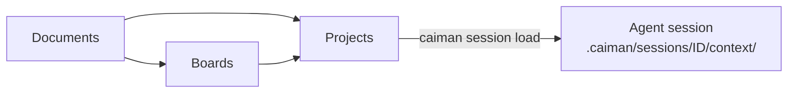

# Caiman

Versioned hardware and specification context for firmware coding agents.

Caiman keeps the reference manuals, board descriptions, and customer
requirements for your firmware work. You declare which board versions and
documents a program uses; Caiman pins them by digest and installs the exact set
into an agent session as ordinary files the agent can search and cite.



**Status:** pre-MVP. Everything below works today on the host. Agents inside
containers are [planned](docs/CONTAINERS.md).

## Install

Requires Python 3.11+ and an interactive terminal.

```bash
python3 -m venv .venv
.venv/bin/python -m pip install -r requirements-dev.lock
.venv/bin/python -m pip install --no-build-isolation --no-deps -e .
.venv/bin/caiman
```

To start with example data (micro:bit v1/v2, Zephyr's sound app, two Adafruit
MacroPad apps; 11 documents, 3 boards, 4 projects, 2 collections):

```bash
.venv/bin/python scripts/load_examples.py --check
.venv/bin/python scripts/load_examples.py --install
```

Importing is idempotent; a conflicting name and version stops it. See
[fixtures/README.md](fixtures/README.md) for sources and licenses.

## Concepts

| Term | Meaning |
|---|---|
| **Document** | One file, stored byte-for-byte, with a name, description, issuer, part or program, and version |
| **Collection** | A named set of documents |
| **Board** | Hardware: parts identified by role, links between them, and their documents |
| **Project** | A program: one or more board versions plus its documents and collections |
| **Pod** | The folder that owns these items; optionally one Git repository. `public` is the permanent default |
| **Session** | One agent conversation, with its own installed context |

Version labels are opaque. Caiman never orders them or picks a "latest"; a bare
name lists its versions.

## The home screen

`caiman` opens cards for **Documents**, **Boards**, **Projects**, **Hooks**, and
**Pods**. Galleries have a tab per pod; the active tab is where new items go.

| Where | Keys |
|---|---|
| Grids | `h j k l` move, Enter opens, `e` edits, `q` goes back or quits |
| Pod tabs | `/` next pod, `[` `]` previous and next |
| Forms | `j l` next, `h k` previous, Enter or `i` edits a field, Escape stops editing |
| Dropdowns | `j k` move, Enter or `l` selects, Escape or `h` closes |
| Home | `c` opens little caiman |

Every edit page has **Review changes**, disabled until the draft differs from
the original. Cancelling before you register writes nothing.

## Documents

**+ Add document** takes any readable file (PDF, Office, text, binary, empty)
and stores it unchanged. There is no conversion and no heading or
requirement-ID check. Choose the destination pod yourself.

```bash
caiman ingest fixtures/documents/microbit-v2-hardware.md
```

Open a document to edit its metadata. Saving writes a new complete revision;
every board, project, and collection that uses the document shows the new
metadata with the same file. **Metadata History** lists earlier revisions,
read-only. Changed file content needs a new document name or version.

**+ Add collection** groups existing documents. Collections have no version;
each save keeps an immutable snapshot.

## Boards and projects

Open a card and press Enter or `e` for the guided editor. Parts, links, and
documents are card grids; **+** adds one; **Choose documents** opens a
searchable picker across local pods. **Edit raw JSON in Vim** opens the whole
draft (`:wq` returns it, `:cq` discards); use it for fields the form hides,
such as lineage.

- A project can pin several boards, including one board at two versions.
- Choosing a **collection** in a project links it live: the project follows the
  collection's current members. Choosing one for a board or part copies its
  members in as direct references.
- Editing a board does not change projects that pin it. Adopt the new board
  version in each project.
- **Delete** removes a version's label. Projects that pinned it keep working.

### JSON drafts and commands

```bash
caiman board template --output draft.json        # also: project
caiman board validate draft.json                  # resolve pins, write nothing
caiman board configure draft.json                 # review and register in the TUI
caiman board show bbc-microbit                    # list versions
caiman board show bbc-microbit --version v2-zephyr-lsm303agr
caiman board export bbc-microbit --version v2-zephyr-lsm303agr --output out.json
caiman board new-version bbc-microbit --from-version v2-zephyr-lsm303agr \
  --version lab-a --relation 'Local experiment'
caiman documents [--pod NAME]                     # document selectors for drafts
```

Drafts may select a document by catalog ref, manifest digest, or stable ID.
Saving stores `{"pod", "document", "blob"}`. Templates and exports are written
`0600` and never overwrite an existing file. Field reference:
[Storage §3](docs/STORAGE.md#3-manifests).

## Pods

A pod is a folder of documents, collections, boards, and projects. References
may point only into the same pod or into `public`.

```bash
caiman pod create alpha
caiman pod connect alpha git@example.com:team/alpha.git   # enable Git; publishes nothing
caiman pod sync alpha                                     # commit, fetch, merge, push
caiman pod clone alpha git@example.com:team/alpha.git     # on a teammate's machine
caiman pod list
caiman pod disconnect alpha                               # keep files and history
caiman pod remove alpha                                   # archive under .removed-pods/
```

Saving never commits or pushes. Sync never force-pushes; a conflict aborts the
merge and leaves both histories for you to resolve with Git. Sync a pod's
dependencies before the pod itself. The Git host controls who can read and push.

## Agent sessions

1. **Hooks → Claude Code** (or **Codex**): pick the project directory, review
   the settings diff, install. Claude Code uses `.claude/settings.local.json`;
   Codex uses `.codex/hooks.json` (trust it in `/hooks`). Restart the harness.
2. Start a session. The hook creates `.caiman/` (Git-ignored) and registers the
   session. If nothing is loaded, the agent asks you what to load.
3. The agent runs:

```bash
caiman session list                                   # every board and project version
caiman session list kestrel                           # one name's versions
caiman session load project kestrel --version dvt-1   # session from $CAIMAN_SESSION
caiman session status
```

The session's `context/` then holds `project.md` (a metadata-only brief),
`project.json`, and `documents/` with every pinned file, read-only. A failed
load keeps the previous context. Each session is independent.

The hook uses the Python environment and store it was installed with;
reinstall it if either moves. If anything goes wrong, the session starts
normally without Caiman context.

**Little caiman** (`caiman little`) shows which managed documents a session
read, searched, or edited, from the harness transcript. It stores no content.
Absence of a record is not proof a document was not read.

## Store

The store lives at `~/.local/share/caiman/store` (respects `XDG_DATA_HOME`).
Override with `--store PATH` or `store_root` in `~/.config/caiman/config.toml`.
Keep it outside firmware repositories. Nothing is sent to any service.

## Development

```bash
.venv/bin/python -m pytest
```

Never commit customer documents or vendor material without redistribution
rights. Read [CLAUDE.md](CLAUDE.md) before changing code.

| Document | Covers |
|---|---|
| [Architecture](docs/ARCHITECTURE.md) | Purpose, components, data model, sessions, trust boundaries |
| [Storage](docs/STORAGE.md) | Layout, schemas, write protocol, Git transport, workspace files |
| [Agents in containers](docs/CONTAINERS.md) | Planned container workflow |
| [Decisions](docs/DECISIONS.md) | Settled and open decisions |
| [Roadmap](docs/ROADMAP.md) | Status, next work, open questions |
