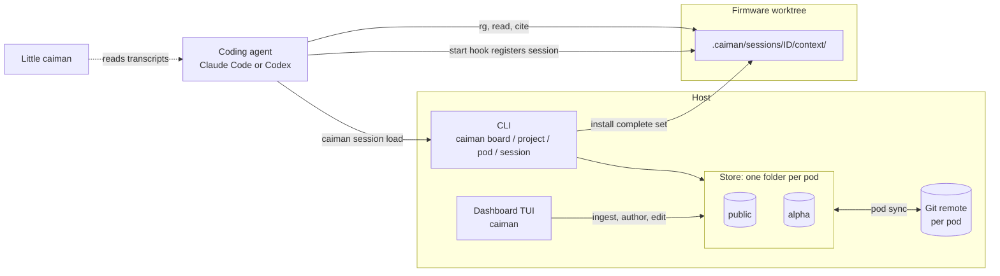
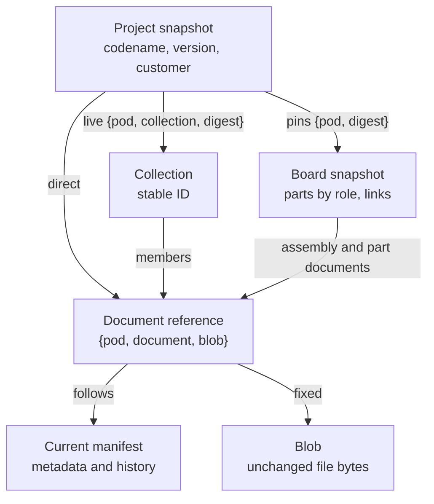
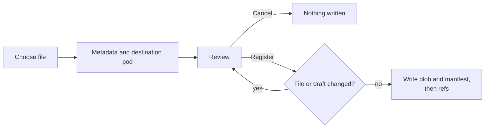

# Architecture

**Owns:** what Caiman is for, its components, the data model, how a session gets
its context, and the trust boundaries.
**Related:** [Storage](STORAGE.md) owns on-disk formats and write protocols.
[Decisions](DECISIONS.md) records why. [Roadmap](ROADMAP.md) tracks planned work
and open questions. [CLAUDE.md](../CLAUDE.md) holds the invariants (I-1 to I-10).

## 1. Problem

A coding agent working on firmware can find a correct fact that is wrong for
this board or this program. Caiman supplies three kinds of context:

| Context | Question | Failure it prevents |
|---|---|---|
| Descriptive | What does this hardware do? | Inventing a register offset |
| Structural | What does this board contain? | Configuring a peripheral that is not routed |
| Normative | What must this program do? | Missing a customer deviation, or using the wrong specification release |

Engineers declare boards and projects. Caiman pins the exact documents they use
and installs them as ordinary files in the agent's session. The agent searches
and cites those files with its normal tools.

## 2. Scope

**Caiman is a layer, not a platform.** It prepares files and gets out of the way.

| Caiman does | Caiman does not |
|---|---|
| Register files unchanged, with human-written metadata | Convert, split, summarize, or run AI on documents (S-08, S-25) |
| Store immutable, digest-pinned boards, projects, and collections | Infer version order, precedence, or conflicts between specifications (I-7, I-8) |
| Share each pod through its own Git repository | Enforce access; Git hosts and the filesystem do that (S-19) |
| Install a complete document set into one agent session | Orchestrate agents, worktrees, containers, or hardware tests (S-01) |
| Show which managed documents a session touched | Run a server, index, or MCP tool between agent and files (S-18) |
| | Host licensed standards such as ISO, AUTOSAR, or MISRA (S-17) |
| | Track compliance or implementation status (S-14) |

## 3. Components



| Package (`src/caiman/`) | Responsibility |
|---|---|
| `documents/` | Ingest one file, edit metadata, metadata history, collections |
| `boards/`, `configurations/` | Board and project validation, drafts, pinning, registration, editors |
| `storage/` | Blobs, manifests, refs, writer lock, journaled ref publication |
| `pods/`, `repositories/` | Pod discovery and identity; optional Git clone, connect, sync; removal |
| `sessions/` | Session folders, context resolution, recoverable installation |
| `hooks/` | Install the harness start hook; produce the start-of-session message |
| `little_caiman/` | Read-only view of a session's managed-document use, from its transcript |
| `dashboard/`, `ui/` | Home screen, galleries, shared widgets and navigation |
| `cli/` | Argument parsing and dispatch |

Core services do not import terminal widgets.

## 4. Data model



- **Document.** One file stored byte-for-byte as one blob, plus a complete
  manifest of metadata. It has a stable `document_id`. Editing metadata writes a
  new complete manifest that links to the previous one; the body never changes.
  Changed bytes need a new document.
- **Board.** Hardware only: parts identified by role (S-12), vendor and part
  number, silicon revision, aliases, links between parts, and attached
  documents. No customer identity, so several programs can share one board (S-13).
- **Project.** A program: one or more pinned board versions, program documents,
  and live collection references. It carries the customer name; agents see only
  the codename (I-6).
- **Collection.** A named set of documents. A project that references a
  collection follows its current membership. Boards and parts expand a chosen
  collection into direct references instead.
- **Pod.** The folder that owns an artifact. See §6.

### Pin semantics

| Reference | Fixed | Followed on normal reads |
|---|---|---|
| Project → board | Board manifest digest | Nothing; exact snapshot |
| Any → document | Stable document ID and blob digest | The document's current metadata |
| Project → collection | Collection ID and its snapshot digest at save time | Current membership and metadata |
| Installed session context | Every resolved identity and body | Nothing; load again to change |

A project digest therefore fixes its boards and every direct document body.
Collection membership and displayed document metadata can still change without
changing that digest (S-14). Installation records what actually resolved.

Version labels are opaque strings (I-7). Nothing parses them, orders them, or
picks a "latest" one. A bare name lists its versions. Lineage (`derives_from`,
`relation`) is declared by a human and only displayed (I-8).

Four version axes are independent: document version, silicon revision, board
version, and project version. Document metadata such as issuer or silicon
revision describes the document; it never restricts where it can be attached.

## 5. Workflows

### Register a document



Any readable file is accepted: PDF, binary, empty, non-UTF-8. There are no
heading or requirement-ID checks (I-5). Registering identical bytes and
metadata again is a no-op. The same name and version with different bytes is
an error.

### Author a board or project

**Prepare** validates the draft and resolves every selector (a named ref, a
manifest digest, or `{document, blob}`) into a stored pin. It checks that each
reference stays in the owning pod or `public`. **Register** repeats the
resolution under the writer lock and refuses if anything moved since review.
Saving an edit moves the label's ref to the new snapshot; the old snapshot stays
readable by digest. Deleting a version removes its ref only. Objects are never
deleted.

Editing a board does not update the projects that pin it. Each project adopts a
new board version explicitly.

### Edit document metadata

The editor shows a field diff and the known local usages. Saving writes a new
manifest whose `previous` is the old digest, then moves the document head and
catalog ref together in one journaled publication. Every reference, including
those from old boards, now shows the new metadata with the same body. The usage
scan is informational; an incomplete scan does not block the save.

### Load context into a session

```mermaid
sequenceDiagram
    participant U as User
    participant A as Agent
    participant H as Start hook
    participant C as caiman session
    A->>H: SessionStart (session_id, cwd)
    H->>H: Create .caiman/ on first use, register the session folder
    H-->>A: What is loaded, or "ask the user"
    A->>U: Which board or project, and which version?
    A->>C: session list [name]
    C-->>A: Versions, unordered
    A->>C: session load project NAME --version V
    C->>C: Resolve, stage, swap in the complete context
    C-->>A: Loaded; read context/project.md
    A->>A: rg, read, and cite under context/documents/
```

The hook never prompts, never provisions, and never reads document bodies
(S-23). A load returns only after the whole context is installed. A per-session
lock serializes loads. Sessions are independent: two agents in one worktree can
load different projects. Resuming a session keeps its folder and context.

Resolution expands each board's assembly and part documents (routed from the
board's pod), then the project's direct documents and current collection
members. Duplicates by `(pod, document, blob)` are dropped. Any missing pod,
manifest, or body fails the load and leaves the previous context in place (I-9).
If two documents would share one installed path, the load fails; neither is
dropped.

The installed context:

```text
.caiman/sessions/claude-SESSION_ID/context/
├── project.md      brief: name, version, snapshot digest, boards and parts, document paths
├── project.json    resolved identities: snapshot, boards, every document and blob
└── documents/
    ├── _index.md   the complete installed set
    └── ISSUER/PART_OR_PROGRAM/NAME@VERSION/document.EXT   read-only copy
```

The path is part of the citation. The brief is built from manifests only and
names the project by codename (I-6). A citation carries the document, its
version, and a locator the source actually has: requirement ID, heading, page,
sheet and cell, or line range (I-5).

## 6. Pods and sharing

A pod is a folder under the store root, optionally its own Git repository.
Every artifact belongs to exactly one pod.

```text
alpha ──▶ alpha      beta ──▶ beta
  │                    │
  └────▶ public ◀──────┘          public ──▶ public only

alpha ──✗──▶ beta     public ──✗──▶ alpha or beta
```

- References may target only the owning pod or `public`, including transitive
  board dependencies (I-1). A missing dependency is an error; nothing is copied
  to fill the gap (I-2).
- `public` always exists, is the permanent default, and cannot be removed. The
  name says nothing about repository visibility or redistribution rights.
- Pod IDs are stable. Renaming the folder or display name changes no reference.
- Saving never commits or pushes. **Sync** commits, fetches, merges, and pushes
  without force. A conflict aborts the merge and keeps both histories (I-3).
  Sync dependency pods before the pods that use them; there is no multi-pod
  transaction.
- **Remove pod** refuses while a board, project, or collection in another pod
  still references it. It moves the folder to `.removed-pods/`; nothing is
  deleted.

[Storage §5](STORAGE.md#5-pod-git-transport) owns the Git transport.

## 7. Hooks and observation

Caiman registers one harness callback, `SessionStart`. It registers the session
and prints a short message. Three rules apply (I-10):

1. **Never deny a tool call.** Caiman uses no `PreToolUse` gate (S-19).
2. **Never fail a session.** The command ends in `|| true` with a 5-second
   timeout; any exception exits 0 with no output.
3. **Never record content.** Only paths, names, versions, and pods.

**Little caiman** (`caiman little`, or `c` on the home screen) shows which
managed documents a registered session read, searched, or edited. It tails the
harness's own transcript and keeps only tool-call inputs that name a managed
path, plus a line range. Tool results, prompts, and shell command text are never
stored or shown. It flags an installed file whose bytes match no stored blob.

**Absence of a record is not proof a document was not read.** Reads through
scripts, variables, other processes, or anything outside the harness are
invisible. Every surface that shows usage says so.

## 8. Trust boundaries

| Boundary | Mechanism | Limit |
|---|---|---|
| Remote pod access | Git host permissions | Anyone who could read a repository keeps its history |
| Local access | OS permissions | Processes running as the same user can read everything |
| Dependency routes | Owning pod plus `public` | Routes, not permissions; an agent may read other files |
| Session folders | Separate directories, per-session lock | Separate selections, not permissions |
| Installed files | Mode `0444`; `.caiman/.gitignore` contains `*` | The owner can chmod; an existing commit cannot be retracted |
| Store integrity | Digest checked on every read; no symlinked refs or directories | Assumes one writer, not a hostile local process |

Caiman does not attest which model receives documents. The human picks the
context and an environment suitable for it.

Other known limits:

- **Switching does not erase.** Loading a new context changes files, not the
  conversation. Start a new session when earlier content must be excluded.
- **Harness residue.** Transcripts, summaries, and harness memory can hold
  copies of document text outside the worktree. Removing a context does not
  remove them.
- **Conversion happens outside Caiman.** A converter can drop or change facts.
  Ingest certifies neither fidelity nor correctness.
- **Metadata can be sensitive.** The brief contains no document text or
  customer name, but board topology, part numbers, and document names may still
  be confidential.

## 9. Failure handling

| Condition | Behavior |
|---|---|
| File or draft changed after review | Refuse; review again |
| Missing pod, document, blob, or board | Refuse and name the missing dependency; never substitute |
| Reference to another non-public pod | Refuse at prepare, and again at register |
| Two installed documents map to one path | Refuse the load and name both pods |
| Interrupted ref publication | Rolled back on the next store open; readers refuse until then |
| Interrupted session install | Finished or rolled back on the next load; the previous context is kept |
| Another writer holds the store lock | Refuse with "Another pod operation is running" |
| Pod sync merge conflict | Abort the merge; keep the local commit and fetched history; resolve with Git |
| Hook error, timeout, or missing install | The session continues without Caiman context |
| TUI command without an interactive terminal | Exit 2; nothing written |

## 10. Testing

Tests live in `tests/` and use synthetic inputs or the public example dataset.
Security behavior gets a failing negative test first: something is *not*
reachable, *not* present, or *not* inferred.

| Invariant | Main tests |
|---|---|
| I-1, I-2: pod routes, missing dependencies | `test_pods.py`, `test_pod_policy.py`, `test_pod_removal.py` |
| I-3: explicit sharing | `test_repo_manager.py`, `test_repo_manager_transport.py` |
| I-4: pins and metadata revisions | `test_config_store.py`, `test_document_updates.py`, `test_live_project_collections.py` |
| I-5: any file accepted unchanged | `test_ingest.py`, `test_document_metadata_retirement.py` |
| I-6, I-7, I-9: brief, opaque versions, complete install | `test_sessions.py` |
| I-10: hooks never block or record content | `test_hooks.py`, `test_sessions.py`, `test_little_caiman.py` |
| Example dataset | `test_examples.py` |
