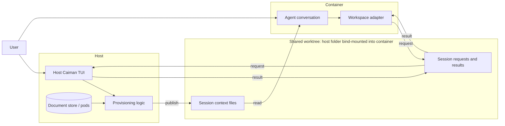
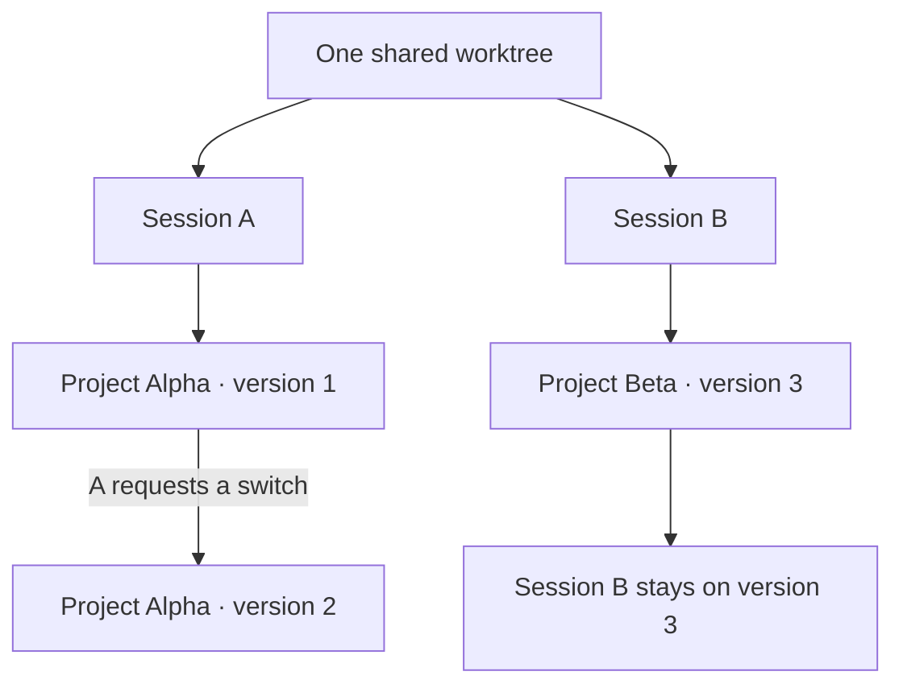
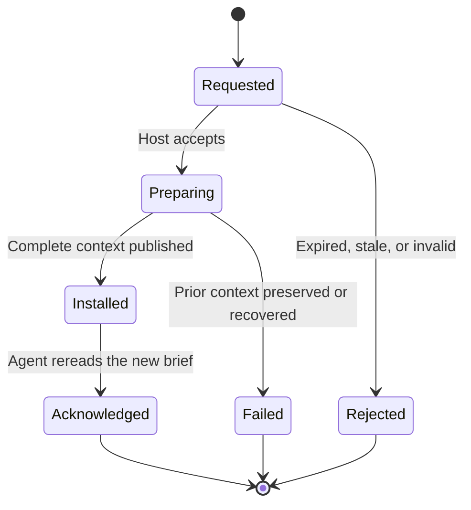

# Session context for agents in containers

**Status: accepted workflow, not implemented.** Accepted by the user on
2026-10-04 as S-39, resolving D-14. This is the canonical design for host-side
provisioning and session switching, for both local agents and agents in containers.
Architecture, storage, and hook documentation refer here for the lifecycle and
protocol rather than defining alternative workflows.

The current [pod model](PODS.md) and [document model](DOCUMENT-METADATA.md)
apply. There is no open/sealed mode or application authorization layer. Every
selected project resolves its complete pinned document set from its owning pod
and public; missing dependencies fail provisioning. Document bodies stay pinned;
metadata follows the current approved manifests, whose exact identities are
recorded when installing a context revision.

## 1. The idea

**Caiman runs on the host. Each agent session gets its own context folder in the
shared worktree.** The host prepares documents, and the agent reads them through
the worktree's existing bind mount.

The user can load or change context in the host TUI. They can also ask the agent
to change it: the agent writes a small request file, the host TUI processes it,
and the agent reads the updated context after receiving the result.

No Caiman package, store, Docker socket, or host shell access is needed inside the
container. A small workspace-local adapter supports hooks and requests, using a
runtime already available in the container. Its compatibility must be verified
before promising that a particular image needs no changes.



The TUI is also the request listener. There is no separate daemon in the first
version. It must remain open for automatic switching to work.

## 2. What lives where

| Component | Location | Responsibility |
|---|---|---|
| Caiman TUI and provisioning logic | Host | Choose context, process requests, resolve documents, publish files |
| Document store and pods | Host | Hold source documents and project snapshots |
| Workspace adapter and hook configuration | Shared worktree | Introduce context, register sessions, submit requests, read results |
| Session context | Shared worktree | Give each session its selected brief and documents |
| Coding agent and harness | Container | Ask the user, request changes, read and use context |

Caiman does not create containers or worktrees. The user creates them with their
existing tools, then initializes the worktree in Caiman.

The worktree mount must allow the container to write request files. Different
host and container paths are fine: exchanged paths are relative to the worktree,
and each side resolves them locally.

## 3. One worktree, several sessions

Context belongs to a **session**, rather than to the whole worktree.

```text
worktree/
├── source files...
└── .caiman/
    ├── workspace.json              Workspace identity and format version
    ├── catalog.json                Context choices published by the host
    ├── listener.json               Host listener identity and recent heartbeat
    ├── adapter/                    Small workspace-local helper
    └── sessions/
        ├── <session-A>/
        │   ├── session.json        Harness identity and session metadata
        │   ├── state.json          Installed revision and last acknowledgement
        │   ├── requests/
        │   │   └── <request-id>.json
        │   ├── results/
        │   │   └── <request-id>.json
        │   └── context/
        │       ├── project.md
        │       ├── project.json
        │       └── documents/
        └── <session-B>/
            └── ...
```

These filenames describe the accepted layout, not a finalized wire format.
Temporary staging folders and recovery records are omitted for clarity.



There is no shared `.caiman/current` pointer. Every agent receives its exact
session context path. Other shared source files remain shared; separate context
folders do not isolate code edits or prevent agents from reading other sessions'
documents.

### What each JSON file is for

The files answer different questions: **which workspace is this, what can I
select, which session am I in, and what is loaded?** They are generated by Caiman
or its adapter; users make selections in the TUI or conversation rather than
editing JSON by hand. The contents below describe responsibilities, not final
field names.

Paths starting with `sessions/<id>/` belong to one session. All paths in this
table are relative to `.caiman/`.

| File | Question it answers | Main contents | Who writes it, and when |
|---|---|---|---|
| `workspace.json` | Which initialized worktree is this? | Stable workspace ID and layout/protocol version | Host Caiman during initialization; updated for supported format migrations |
| `catalog.json` | What contexts can this worktree request? | Selectable entry IDs, display names, pod/project/version identities, and resolved snapshot digests | Host Caiman at initialization and when the user refreshes or changes the published choices |
| `listener.json` | Is host Caiman available to process requests? | Listener instance ID, protocol version, and heartbeat timestamp | Host TUI while it owns the worktree listener |
| `sessions/<id>/session.json` | Which agent session owns this folder? | Workspace ID, harness name, session ID, creation time, and parent session identity when applicable | Workspace adapter when registering the session; reused on resume |
| `sessions/<id>/state.json` | What is installed, and has the agent adopted it? | Installed context identity and revision, installation time, last successful switch request, and last acknowledged revision | Host Caiman after installation, recovery, or processing an agent acknowledgement |
| `sessions/<id>/requests/<request-id>.json` | What operation is the agent asking for? | Unique request ID, operation type, routing identities, protocol version, expiry, and operation-specific fields | Workspace adapter when the agent submits an operation |
| `sessions/<id>/results/<request-id>.json` | What happened to that request? | Matching request ID, operation status, installed revision and relative brief path when relevant, or an actionable error | Host Caiman as it processes the request and records its outcome |
| `sessions/<id>/context/project.json` | What exactly is in the installed context? | Resolved project structure, selected snapshot identities, and document pins needed to describe the provisioned context | Host provisioning logic, alongside the brief and documents, on each successful provision |

For requests, a **switch** carries the catalog selection, digest, and expected
current revision described in §6. An **acknowledgement** carries the revision
the agent reports having reread. The host processes both, so it remains the sole
writer of `state.json`; the agent never races the host by editing that file.
An acknowledgement of an older revision must not mark a newer installation as
adopted. If acknowledgement delivery fails, the documents remain usable, but the
TUI continues to show the installed revision as unacknowledged.

Some distinctions matter:

- **Catalog versus project:** `catalog.json` lists available choices;
  `context/project.json` describes the one actually installed for this session.
  Refreshing the catalog does not change installed context.
- **Session versus state:** `session.json` identifies the conversation;
  `state.json` tracks its changing context. Switching context preserves session
  identity.
- **State versus result:** state describes the current installation; a result
  describes a particular operation. An old successful result does not mean its
  context is still current after another switch.
- **Heartbeat versus guarantee:** a recent `listener.json` heartbeat suggests
  availability; only a matching result confirms that an operation was processed.
  A leftover listener file after a crash does not mean the TUI is still running.
- **JSON versus brief:** `project.json` is the structured description;
  `project.md` is the readable starting point the agent is told to open.

Shared JSON is a communication format, not proof of authorization. In particular,
editing `catalog.json`, `workspace.json`, or `session.json` must not grant access
to additional host choices or redirect writes outside the registered worktree.
The host checks requests against its own registration and selection rules.

### Session identity

- Namespace a harness-provided session ID by harness and map it to a safe folder
  name. Do not use unchecked event text as a filesystem path.
- Resuming the same session reuses its folder. A new or forked session gets a new
  folder; copying the prior selection can be offered explicitly.
- Subagents inherit their parent's context by default. Give them separate
  context only when independent selection is requested. Pause dependent
  subagents before switching their shared parent context.
- A harness without a reliable ID needs an adapter-issued ID persisted for that
  session, or explicit session selection. Never silently assign every session
  the same folder.

## 4. First-time setup

In the host TUI, the user chooses **Initialize worktree**:

1. Select the host worktree folder.
2. Create `.caiman/` and a stable workspace identity.
3. Publish the contexts available for selection, using pod/project/version
   identities and resolved snapshot digests.
4. Choose whether agent requests may automatically select among those choices.
5. Install the workspace adapter and supported harness hook configuration,
   preserving existing hooks. Keep generated state and documents out of Git and
   container build contexts.
6. Start listening for session registrations and switch requests while the TUI
   remains open.

Initialization prepares the worktree. Provisioning loads documents into a
specific session. The user may nominate an initial context during setup; each
new session still gets its own folder and a visible selection.

Hook configuration may need a new harness session or a harness-specific trust
step before it becomes active. Each supported harness needs an actual container
integration check; writing configuration alone is not proof that the hook ran.

### Worktree and mount checks

Initialize a host folder at the top of a Git worktree. Keep `.caiman/` ignored,
verify the repository's commit guard (including `core.hooksPath`), and exclude
`.caiman/` from container build contexts before publishing documents. Preserve
existing hooks when installing integration. Multi-repository workspace roots
still need a separate design (G29).

The supported container setup bind-mounts the worktree from that host with write
access for adapter requests. Mount the worktree, not a separate `.caiman/` or
session context directory: a mount of a replaced directory may retain an older
generation after installation. Container writable layers, named volumes, and
remote-daemon paths are not substitutes for this host worktree.

The initial TUI selects the host path. Docker discovery is not required by this
workflow. Caiman does not create, start, exec into, copy into, or commit containers.
No Docker socket is exposed to the adapter. Host and container paths may differ;
validate Git worktree and hook paths separately from the relative request paths.

Report clone, hardlink, or copy behavior at review. Read-only hardlinks are only
an accident guard: an owner or root process can change their modes and modify the
shared inode. Prefer filesystem clones; the fallback decision remains in
[Storage §13.1](STORAGE.md#131-open-questions).

## 5. Starting a session

The startup hook registers the session and supplies the current context summary
and instructions to the agent. **The agent asks the question; the hook does not
wait for interactive input.**

```mermaid
sequenceDiagram
    participant U as User
    participant A as Agent / harness
    participant H as Workspace adapter
    participant T as Host TUI
    A->>H: Session-start event
    H->>H: Register session; inspect its context
    H-->>A: Session path, current selection, available choices
    A->>U: Keep this context or choose another?
    alt Keep an installed context
        U->>A: Keep it
        A->>A: Read session brief and continue
    else Select or change context
        U->>A: Use another context
        A->>H: Submit selection for this session
        H->>T: Request file through shared worktree
        T->>T: Prepare and install context
        T-->>H: Result with installed revision
        H-->>A: Ready; brief location
        A->>A: Read brief and acknowledge revision
        A-->>U: Context loaded; continue
    end
```

If no context is installed, ask the user to select one. If the host is offline,
an already installed context can still be used; new provisioning waits for the
host. If initialization is missing, explain how to initialize from the host.

The catalog gives the agent enough information to offer choices without access
to the store. An ambiguous choice needs clarification; it must not silently
select a different pod or version.

## 6. Changing context during a session

Both entry points use the same host provisioning logic:

| Entry point | User action | Handoff to the agent |
|---|---|---|
| Agent conversation | Answer the agent or ask it to switch | Agent submits a request, waits, then rereads the brief |
| Host TUI | Select a session and a new context | TUI installs it and displays an instruction to tell that agent to reread |

For a direct TUI change, pause the affected agent and its context-reading
subagents first. The host cannot assume that it knows whether they are reading.
Automatic interruption or notification of an idle harness is outside the first
version; a file update alone does not inject a message into a conversation.

### A small request contract

| Field | Purpose |
|---|---|
| Protocol version | Detect incompatible adapters and host versions |
| Workspace and session identity | Route the request to the registered session |
| Unique request ID | Make retries return the same operation's status |
| Selected catalog entry and digest | Specify exactly what the user selected |
| Expected current revision | Detect another change since the selection was made |
| Expiry | Prevent forgotten queued requests from running much later |

Results identify the request, status, installed revision and relative brief
path, or an actionable error. No request contains a shell command or arbitrary
host destination.

The adapter publishes a complete request by writing a temporary file and
renaming it. The host does the same for results. Periodic directory scanning is
sufficient for the first version; correctness must not depend on receiving every
filesystem watcher event across Docker's file-sharing layer.

### When is a switch finished?



**Installed** means the files are ready. **Acknowledged** means the agent reports
that it reread that revision. It does not prove that old information has been
erased from its conversation or reasoning.

A startup hook stays short. The agent submits and checks requests after the user
answers, through ordinary tool calls; no long-running startup hook is required.

## 7. Keeping updates reliable

The host serializes changes for each session, including direct TUI changes.
Different sessions can have independent selections.

| Situation | Expected behavior |
|---|---|
| Two changes target the same session | Process serially; reject a request whose expected revision is stale |
| A request is retried | Return its recorded status; do not apply it twice |
| A catalog entry changed | Report stale selection and refresh choices; do not silently substitute the new digest |
| A required document or pod is missing | Fail with the missing dependency; keep the previous context |
| TUI is closed | Report listener unavailable; retain usable installed context |
| Agent stops waiting | Report status as unknown/pending, not canceled; query the same request ID before retrying |
| An unaccepted request expires | Reject it, including after TUI restart |
| Host crashes during installation | Recover the recorded transition, then publish the result |
| Adapter protocol is unsupported | Give a compatibility error and retain existing context |

An expiry is the deadline to accept a request, not permission to abandon an
installation halfway through. Once accepted, its result must remain discoverable.
Only one host listener owns a worktree at a time; startup should detect an
existing owner and recover unfinished operations before accepting new ones.

Build and validate the replacement in a staging directory before changing the
active context. Keep requests, results, and session identity outside the replaced
directory. Record enough information to recover both the installed revision and
the corresponding request result after a crash.

The [storage design](STORAGE.md#installing-a-generation) uses a recoverable
directory swap. That avoids partially populated directories, but is not a
portable atomic replacement of a nonempty directory: there may be a brief gap.
For this first version, the affected agent waits during installation. Do not
claim uninterrupted reads or mixed-version protection for uncoordinated readers.

## 8. Boundaries and lifecycle

### What automatic requests authorize

During host initialization, the user enables automatic switching among published
choices for that worktree. This is delegation to processes that can write its
request files. An agent-written request cannot independently prove that a human
approved it in conversation.

The host validates request size and shape, catalog selection, identities, and
destination containment. Treat request files as untrusted input, reject path
traversal and symlink escapes, and never execute commands from them. Host-owned
registration and selection rules must not be expanded merely by editing the
shared catalog or workspace metadata.

Session folders separate selections, not permissions. An agent with access to
the worktree may see another session's context. Workloads requiring document
isolation need separate filesystem boundaries.

### What a context switch changes

A switch changes the documents the session should use from that point onward.
It does not remove prior tool output, conversation content, or transcripts.
Use a fresh session when old information must be excluded.

### Session cleanup

Retain session folders across container and harness restarts so resumed sessions
can recover their selection. Show session identity, context, last activity, and
installed/acknowledged revision in the TUI. Last activity is informational; quiet
does not mean finished.

Provide explicit cleanup for old sessions. Do not delete a session with an
in-progress installation, and explain that deleting its context does not delete
the harness transcript. Detailed retention policy can be decided separately.

## 9. Implementation scope and remaining decisions

The first version includes host TUI initialization, a portable workspace adapter,
session registration, a published context catalog, request/result files,
recoverable provisioning, and an explicit agent reread step.

It does not require a background daemon, network API, Docker socket, store mount,
or full Caiman installation inside the image. Container creation, transcript
management, detailed usage auditing, and automatic harness interruption remain
separate work.

Before implementation, settle these concrete details:

| Decision | What needs verification |
|---|---|
| Adapter runtime | Which existing tools the target containers guarantee |
| Harness integration | Session IDs, resume/fork/subagent behavior, hook trust and activation |
| Request schema | Format version, status values, expiry and retry behavior |
| Published choices | How the host user selects and refreshes the catalog |
| Storage installation | Recovery ordering and behavior through the actual bind mount |

The [current hook installer](../src/caiman/hooks/service.py) embeds the host
Python executable and store path. It cannot serve as this container adapter
unchanged. Workspace materialization is also not yet implemented; existing
hook support should not be mistaken for the complete workflow described here.

### Acceptance scenarios

- Initialize a bind-mounted worktree and start a session without installing
  Caiman inside the container, using the adapter's documented prerequisites.
- Start two sessions in one worktree; change A's context without changing B's.
- Resume a session and recover its exact installed selection.
- Request a switch in conversation, receive its result, and acknowledge the new
  brief before continuing.
- Close the TUI, submit a request, and get a clear unavailable/expiry outcome.
- Retry a request and receive the same result without a second installation.
- Race a TUI change with an agent request and reject the stale request.
- Interrupt provisioning and recover a complete context and consistent result.
- Reject malformed requests and destinations escaping the registered worktree.
- Reject attempts to expand host-authorized choices by editing shared metadata.
- Resume after container replacement with the same host worktree and session ID.
- Reject stale acknowledgements without marking a newer revision adopted.
- Verify Git and build exclusions, hook activation, and differing host/container paths.

These checks should run against the supported harness and container setup, not
only against host filesystem unit tests.
