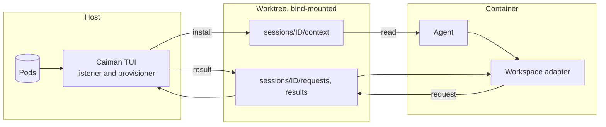
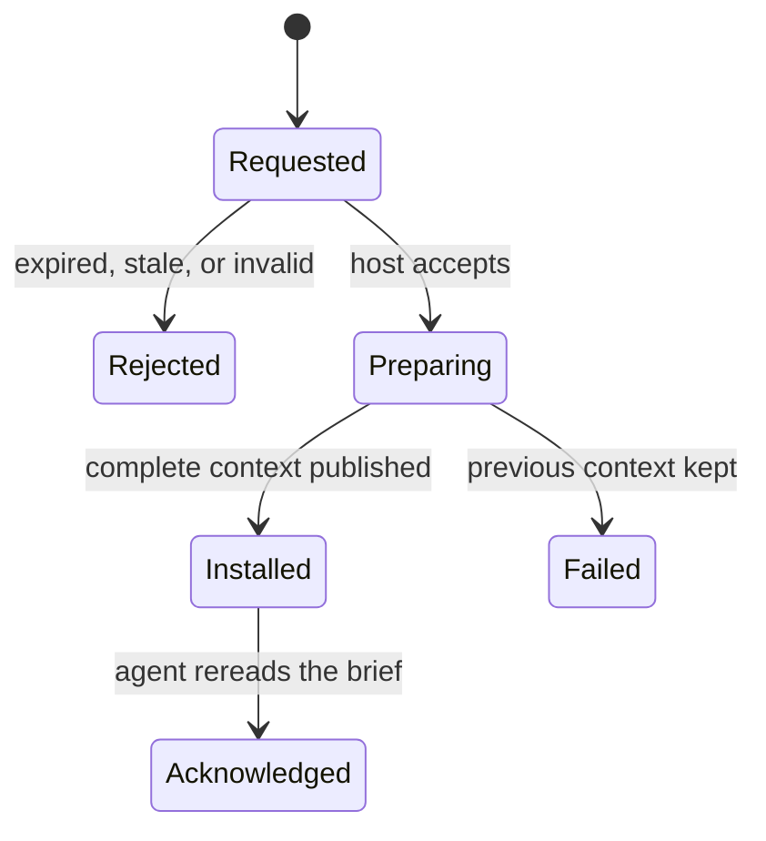

# Agents in containers (planned)

**Status:** Accepted design (S-39), not implemented. Agents running on the host
already load context directly with `caiman session load` (S-40); see
[Architecture §5](ARCHITECTURE.md#load-context-into-a-session).
**Owns:** how an agent inside a container gets and switches its session context.

## 1. Idea

Caiman stays on the host. The container sees the worktree through its existing
bind mount, so it can read `.caiman/sessions/ID/context/` without the store, the
Caiman package, a Docker socket, or host shell access. To change context, the
agent writes a request file; the open host TUI processes it.

There is no daemon. Automatic switching works only while the TUI is open.

## 2. Workspace additions

On top of the host layout in [Storage §6](STORAGE.md#6-session-workspace):

| Path under `.caiman/` | Purpose | Writer |
|---|---|---|
| `catalog.json` | Choices this worktree may request: pod, name, version, snapshot digest | Host, at initialization or refresh |
| `listener.json` | Listener ID, protocol version, heartbeat | Host TUI while open |
| `adapter/` | Small helper the harness hook calls | Host, at initialization |
| `sessions/ID/requests/REQ.json` | One operation: switch or acknowledge | Adapter |
| `sessions/ID/results/REQ.json` | Outcome of that request | Host |

The host is the only writer of `state.json`. Editing the catalog or any shared
JSON never widens what the host will install or where it writes.

## 3. Setup

**Initialize worktree** in the host TUI:

1. Choose the host folder at the top of a Git worktree.
2. Create `.caiman/`, confirm it is Git-ignored, check the commit guard
   (including `core.hooksPath`), and exclude it from container build contexts.
3. Publish the selectable contexts to `catalog.json`.
4. Choose whether agent requests may switch among those choices automatically.
5. Install the adapter and harness hook config, preserving existing hooks.
6. Listen while the TUI stays open.

Mount the whole worktree with write access. Do not mount `.caiman/` or a
`context/` folder separately: a mount of a replaced directory can keep showing
the old one. Container layers, named volumes, and remote Docker daemons are not
supported. Host and container paths may differ; exchanged paths are relative to
the worktree.

## 4. Switching

A request carries: protocol version, workspace and session IDs, a unique request
ID, the catalog entry and digest, the expected current revision, and an expiry.
Files are written to a temporary name, then renamed. The host polls; it does not
rely on file-watcher events across Docker's file sharing.

**Installed** means the files are ready. **Acknowledged** means the agent says
it reread that revision. An older acknowledgement never marks a newer revision
acknowledged. Neither proves the agent forgot earlier context.

| Situation | Behavior |
|---|---|
| Two changes to one session | Processed in order; a stale expected revision is rejected |
| Retried request ID | Returns the recorded result; never installs twice |
| Catalog entry changed | Reject as stale; never substitute the new digest |
| Missing dependency | Fail; keep the previous context |
| TUI closed | Installed context still usable; new requests report unavailable, then expire |
| Agent stopped waiting | Status is pending, not cancelled; query the same ID before retrying |
| Host crash mid-install | Recover the install and its result before accepting new requests |
| Unsupported protocol | Compatibility error; keep the installed context |

A switch from the TUI side needs the user to pause the affected agent and its
subagents first. Caiman cannot interrupt a harness.

## 5. Sessions

- Folder names come from the harness session ID, namespaced by harness and
  checked as a safe name.
- Resume reuses the folder. A new or forked session gets a new one; copying a
  selection is explicit.
- Subagents share their parent's context unless given their own.
- A harness without a reliable ID needs an adapter-issued ID. Never put every
  session in one folder.
- Keep session folders across restarts. Offer explicit cleanup; never delete a
  session mid-install. Deleting a context does not delete transcripts.

## 6. Open before implementation

| Question | What to verify |
|---|---|
| Adapter runtime | Which tools the target images reliably have |
| Harness integration | Session IDs; resume, fork, and subagent events; hook trust |
| Request schema | Field names, status values, expiry and retry rules |
| Catalog | How the host user picks and refreshes choices; how moved labels are shown (G28) |
| Install through a bind mount | Recovery ordering as seen from inside the container |
| Multi-repository roots | `west`, `repo`, `kas` workspaces are not one Git repo (G29) |

The current start hook embeds the host Python path and store path, so it cannot
serve as the container adapter unchanged.

## 7. Acceptance

Run against a real harness and container, not only host unit tests:

- Start a session in a bind-mounted worktree with no Caiman inside the container.
- Two sessions in one worktree; switch A, B is unchanged.
- Resume, including after replacing the container, and recover the same context.
- Switch from conversation; receive the result; acknowledge.
- TUI closed: clear unavailable and expiry outcomes.
- Retry: same result, one install. Race a TUI change against a request: the
  stale one is rejected.
- Interrupt an install: complete context and consistent result after recovery.
- Malformed requests, path traversal, symlink escapes, and edited catalogs
  change nothing.
- Git and build exclusions hold; hooks activate; differing host and container
  paths work.
