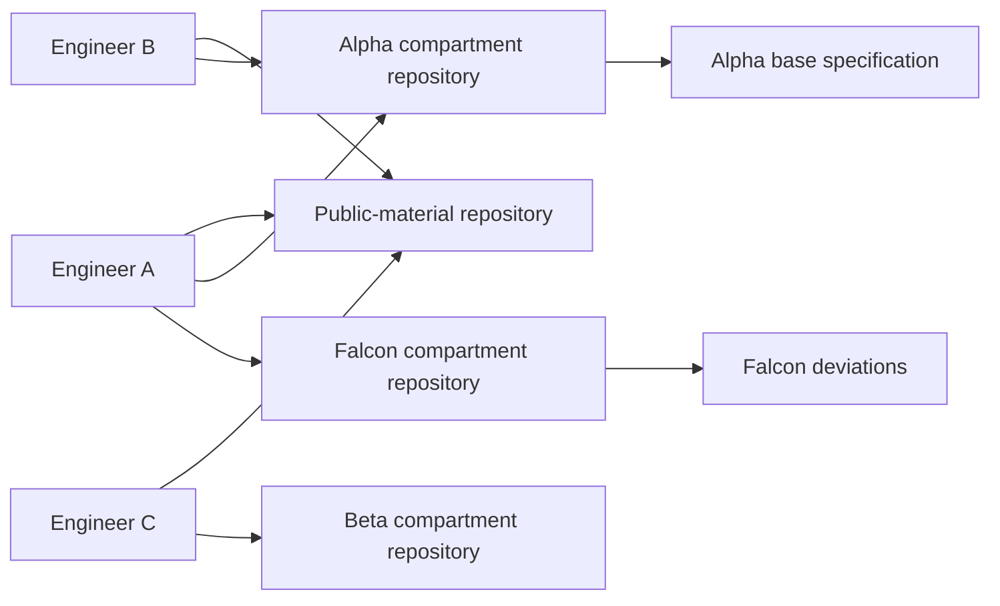
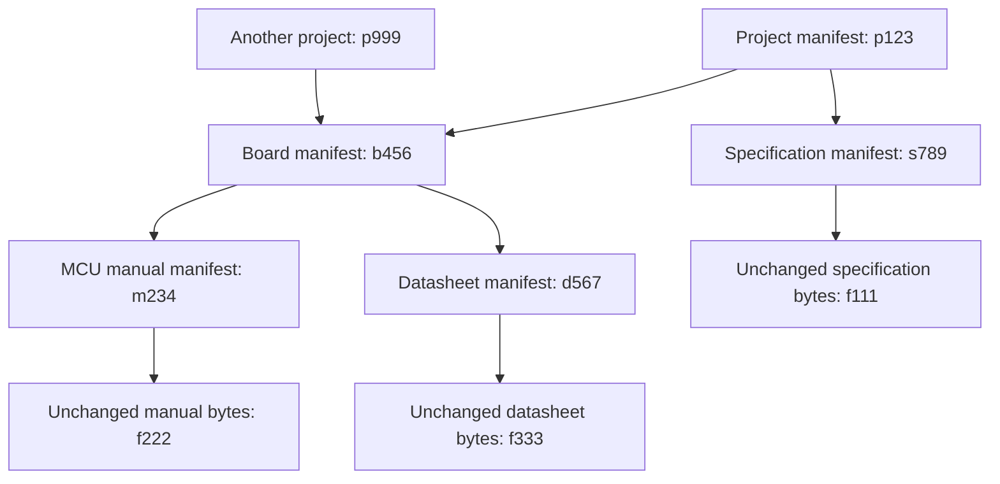
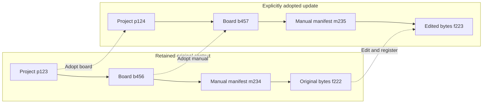
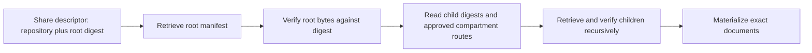
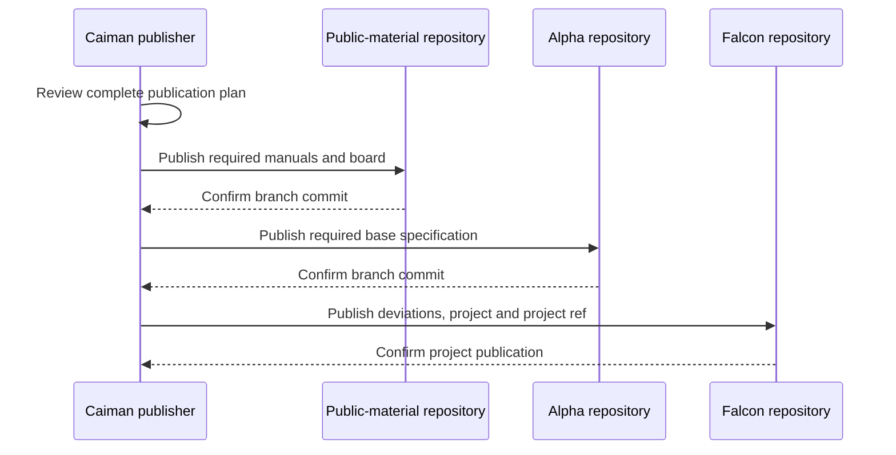

# Storage Design

**Current pod model:** [PODS.md](PODS.md) supersedes the access-label,
compartment, catalog-authorization, and separate-repository-mirror rules below.
Pods are local folders with optional Git sharing; the Git host owns remote
permissions. Older sections are retained as design history.

**Current document model:** [DOCUMENT-METADATA.md](DOCUMENT-METADATA.md) supersedes
the historical document-manifest pin graph and hardware attachment rules below.
Document references now pin stable IDs and bodies while following current metadata.

**Status:** Accepted. Local storage and Repo Manager repository setup are
implemented. Team storage (per-compartment Git transport, publication, verified
fetch, and context snapshots) is adopted (S-35) and not yet implemented; §14 sets
the implementation order. Session materialization is planned.
**Scope:** The on-disk representation of documents, boards, and projects; how
they are shared between teammates through Git; and the procedure that builds a
session workspace from them.
**Owns:** Object model, manifest schemas, store layout, repository format,
publication and fetch protocol, content identity (Merkle DAG, document-set and
context digests), materialization mechanics, retention, and backup.
**Related:** [Architecture §6.6](ARCHITECTURE.md#66-store) and [§6.8](ARCHITECTURE.md#68-materialize);
`SECURITY-MODEL.md` owns classification and the threat model; `harness.md` owns
harness residue; [research](research/storage_architecture_research.md) holds the
sources and rejected alternatives for team storage.

---

## 1. Summary

The store contains immutable blobs and JSON manifests addressed by SHA-256,
plus mutable refs mapping names to manifest digests. Compartments occupy separate
top-level directories. No database or running service is required.

Teammates share the store through **one private Git repository per
compartment** (S-33), each with a dedicated publication branch, `caiman-store`.
Public documents live in their own private repository. The Git host provides
authentication and read/write permission; Caiman provides local authoring,
review, dependency-aware publication, verified fetching, and session
materialization. There is no custom authentication service, synchronization
daemon, retrieval server, or public content network.

Boards pin document manifests, and projects pin boards and documents, so the
object graph is a Merkle DAG: one root digest identifies a complete
configuration. A share descriptor adds the repository location needed to fetch
it. Publishing a project means its dependencies were published first; a teammate
needs access to every dependency repository to reconstruct it.

The accepted tradeoff is repository administration and permanent history. This
backend has no per-object server-side authorization and cannot delete copies
already fetched. §12.1 records when that stops being acceptable.

## 2. Background and Problem

### 2.1 What changed

S-18 removed the retrieval service. S-21 chose a filesystem store with an
OCI-like layout. S-22 chose Git for transport and backup, first as one private
repository for a single engineer. S-33 replaced that topology with one repository
per compartment once teammates needed different access by customer and project.
S-35 adopts the team storage protocol in this document.

### 2.2 The failure this design prevents

Re-converting the same vendor release produces different bytes under the same
version label. Repointing its ref must not change existing board or project pins.
Manifest digests preserve both versions without inventing a new vendor label.

### 2.3 Why access labels must be part of object identity

Labels are part of the hashed manifest. Correcting a compartment produces a new
digest over unchanged content, making the correction visible to downstream pins.
[Security §8](SECURITY-MODEL.md#8-reclassification-and-revocation) owns the
reclassification procedure.

### 2.4 Why teammates need a shared store

Several engineers work on programs for different counterparties. Engineer A may
hold Alpha and Falcon; engineer C may hold only Beta. Each must reconstruct
exactly the pinned configuration and document bytes another engineer registered,
and none may obtain a compartment they were not granted. A shared filesystem or
a single repository cannot express different readers; per-compartment
repositories let the Git host enforce read access without a Caiman service.

## 3. Goals

Store immutable versions, resolve names and digests, preserve every pinned object,
share them between teammates with host-enforced access, and assemble workspaces
efficiently. §5 lists the verifiable requirements.

## 4. Non-Goals

| Not provided | Rationale |
|---|---|
| Query, search, or ranking over content | Retrieval happens with `grep` over the materialized documents (S-04, S-18) |
| Partial fetch within an object | Fetch whole files into the local store; agents can read selected ranges locally (§6.3) |
| Concurrent local writers | One engineer per machine. Local ingest is serialized by the CLI; each transport mirror has an advisory lock (§6.6.5). Concurrent *publishers* are handled (§7.6.3) |
| High throughput | Volume is hundreds of documents, not millions. No capacity claim is measured yet (§10) |
| Authentication or authorization service | The Git host authenticates and grants repository access; locally, POSIX permissions |
| Per-object server-side authorization or withdrawal | A repository reader can obtain every object and all history. Withdrawal is advisory (§8.3). §12.1 is the trigger to revisit |
| Deleting copies already fetched | Revoking a member affects future host access only |
| Deleting unreachable objects | Garbage collection is specified (§8.5) but not implemented; disk is cheaper than the risk of breaking a pin |
| A shared global catalog | It would enumerate private customers and project names. Discovery is limited to explicitly configured repositories (§7.7) |
| Background synchronization | Fetch and publication are explicit acts |
| Publishing session receipts or read logs | They stay local (§6.7.3, I-10) |

---

## 5. Requirements and Constraints

### 5.1 Functional requirements

| ID | Requirement | Source |
|---|---|---|
| R-1 | Objects are immutable once written | I-4 |
| R-2 | A name plus version resolves to exactly one digest at a given time | I-4 |
| R-3 | A bare name without a version does not resolve; it returns the list of versions | I-7 |
| R-4 | Changing a document's labels yields a new document version digest | `SECURITY-MODEL.md` |
| R-5 | A project version resolves transitively to a complete pin set, including everything each of its board versions pins | S-07 |
| R-6 | Materialized files are read-only | I-9 |
| R-7 | No symbolic links to directories appear in the materialized documents | I-9 |
| R-8 | A document version that cannot be fully materialized causes `sync` to fail | I-9 |
| R-9 | Content for compartment A is never written into a workspace for a session that does not hold A | I-1, S-16 |
| R-10 | A document with neither a public assertion nor a compartment is unreachable | I-1 |
| R-11 | Target privacy, approved hosting, and compartment identity are checked before any object is sent; a failed check is a hard error | S-16, I-1 |
| R-12 | Nothing is pushed to a remote until its labels have been reviewed | §9.5 |
| R-13 | Fetched content lands in a directory already at mode `0700`; blobs are `0444`. Permissions are established before transfer, never repaired afterward. Git carries neither mode | I-9, S-16 |
| R-14 | A fetch that would change an existing blob's content is an error, not a merge | R-1 |
| R-15 | Teammates reconstruct identical pinned configurations and document bytes | S-35 |
| R-16 | Customer/project access is enforced by remote repository permissions | S-33 |
| R-17 | Every object, including configuration metadata, has an explicit classification | I-1 |
| R-18 | A document is public or has exactly one compartment; users and projects may hold several | S-33 |
| R-19 | Publication sends only reviewed objects and named reference changes | I-3 |
| R-20 | Concurrent publishers cannot silently overwrite the same application ref | I-4 |
| R-21 | A published root has a complete retained dependency graph at publication time | R-5 |
| R-22 | Sessions hold digests; friendly labels never re-resolve during a session | I-4 |
| R-23 | Local authoring and already-materialized work remain usable without the remote | S-18 |
| R-24 | Git transport cannot rewrite source file bytes or legacy manifests | S-25, S-11 |
| R-25 | A document-set digest is distinct from a context digest and from a session receipt | §6.7.3 |
| R-26 | Existing stores migrate without destroying their old objects or pins | S-11 |

### 5.2 Environmental constraints

| Constraint | Consequence for the design |
|---|---|
| Primary platform is macOS on APFS | Use `clonefile(2)` as the preferred link mechanism (§7.3) |
| Worktrees may live on a different volume from the store | Must fall back to copying; cross-volume clones and hardlinks are not possible |
| Separate APFS volumes within one container are distinct filesystems | Volume co-location cannot be assumed from "same disk" |
| Markdown documents are large — a 2,000-page reference manual is roughly 20 MB | Keep whole files; prefer CoW/link-based materialization to per-session copying |
| The user supplies a document in any format | Source and converter provenance are optional; compute the file digest regardless (S-26) |
| Session harnesses persist plaintext copies of files the agent reads, outside the store | Re-materialization does not fully revoke access; see §9.6 |
| The initial team is small, with trusted publishers and differing read access | Publisher trust is part of the contract (§9.7); capacity tests use synthetic data |
| Git offers no transaction across repositories | Publication is dependency-first and root-last, with partial results reported (§7.6.2) |
| Git hosts impose per-file and push limits (GitHub, at the research date: warns above 50 MiB, blocks above 100 MiB) | Preflight host limits before upload; limits live in a host capability profile, not the schema (§10) |

---

## 6. Design

### 6.1 Object model

The store holds three object kinds. Two are immutable and named by digest; one is
mutable and named by a path.

| Object | Mutable | Named by | Contains |
|---|---|---|---|
| **Blob** | No | SHA-256 of its bytes | One unchanged document, or a generated file in a context snapshot |
| **Manifest** | No | SHA-256 of its serialized JSON | One version of a document, board, project, document set, or context: its metadata and its references to other objects |
| **Ref** | Yes | A human-readable path | The digest one name/version currently points to |

The two-level split between blob and manifest is the central structural decision,
and it is worth stating precisely because the terms are easy to conflate.

- A **blob is one file.** The entire input manual is a blob. Its digest covers
  the exact input bytes.
- A **manifest is one version of one document.** "NXP S32K344 reference manual,
  rev-4" is a manifest. It references one content blob, with its materialized
  filename, and carries all metadata: issuer, version, applicable
  silicon revisions, access labels, provenance.

```
manifest sha256:9f3c22de…71        nxp/s32k344 reference-manual rev-4
  └── document.md      → blob sha256:3f9c1a8e…b2 (complete unchanged manual)
```

**Board/project pins reference configuration manifest digests. Document references
carry a stable document ID and fixed blob digest.** Every approved metadata edit
creates a complete manifest pointing to the same body, then advances the document's
current pointer. Existing consumer snapshots remain unchanged, including old boards;
normal document views show the current metadata. Exact manifest reads retain history.
See [DOCUMENT-METADATA.md](DOCUMENT-METADATA.md) for the current authoritative design.

In the local store a ref is a single line holding one manifest digest. In a
shared repository it is a canonical record with a `generation` counter (§6.6.4).

### 6.2 Directory layout

```
~/.local/share/caiman/store/
├── public/
│   ├── blobs/sha256/
│   │   ├── 3f/3f9c1a8e…b2                        mode 0444
│   │   ├── 7d/7d02ff41…9a
│   │   └── e1/e18b77c0…04
│   ├── manifests/sha256/
│   │   ├── 9f/9f3c22de…71                        document version
│   │   └── c4/c4a10b93…88                        board version
│   └── refs/
│       ├── documents/
│       │   ├── nxp/s32k344/reference-manual/rev-4   → sha256:9f3c22de…71
│       │   ├── nxp/s32k344/reference-manual/rev-3   → sha256:5a71e0cc…13
│       │   ├── nxp/s32k344/errata/rev-6             → sha256:b8d4109f…2e
│       │   └── ti/tps65313/datasheet/2024-03        → sha256:44ce8a71…d0
│       └── boards/
│           ├── zonal-ctrl-rear/2.0                  → sha256:71ba0e4d…9c
│           └── zonal-ctrl-rear/2.1                  → sha256:c4a10b93…88
│
├── oem-alpha/                                       mode 0700
│   ├── blobs/sha256/…
│   ├── manifests/sha256/…
│   └── refs/
│       ├── documents/
│       │   ├── oem-alpha/flash-spec/3.2             → sha256:2d90ac17…a5
│       │   ├── oem-alpha/secoc-spec/3.1             → sha256:6e3f1180…77
│       │   └── oem-alpha/deviations-falcon/2026-06  → sha256:aa47c3b2…19
│       └── projects/
│           ├── falcon/A-sample                      → sha256:1c8e4470…3b
│           └── falcon/B-sample                      → sha256:9e21ffa6…c7
│
├── oem-beta/
│   └── (same structure, no shared objects)
│
├── .repositories.json                               Repo Manager registry (§7.5)
└── .repositories/<compartment>/                     one Git mirror per compartment
```

The two-character directory level (`3f/`, `9f/`) is the first two hex characters
of the digest. It exists only to keep any single directory from accumulating tens
of thousands of entries, which degrades directory operations on most filesystems.
It carries no meaning and is derivable from the digest.

Four consequences of this layout are load-bearing:

**Mutable state is confined to one directory.** `refs/` is the only part of the
store that ever changes after a write. Everything under `blobs/` and `manifests/`
is created once and never modified. This makes R-1 a structural property rather
than a rule the code has to remember, and it makes the distinction between a tag
and a pin — the subject of I-4 — visible in the directory structure.

**Compartments are separate trees, so local access control is `chmod`.**
Satisfying R-9 locally requires only `chmod 0700 store/oem-alpha`. Application
code does not mediate access to compartmented content; the kernel does. This
composes with the optional hardening described in `SECURITY-MODEL.md` (a dedicated
uid, or a per-compartment encrypted disk image) without any change to the layout.
Each compartment tree maps to exactly one remote repository (§6.6).

Manifests are partitioned along with blobs, not left in a shared tree. A project
manifest contains the customer's legal name; a document manifest names the
specification and its version. Both are compartment-sensitive even when no
document content is read.

**Boards are public; projects are compartmented.** Hardware carries no customer
identity, which follows from S-13. The practical benefit is that one board
version is shared by several customers' projects with no duplication and no
cross-compartment reference: each project manifest holds the same public board
digest. A classified board schema for confidential topology is an open question
(§13.1).

**The layout is OCI-inspired, not OCI-compatible.** Blobs correspond to layers,
manifests to manifests, refs to tags. Caiman's custom manifests would still need
an adapter to interoperate with an OCI registry. D-02 records when to revisit
that move.

### 6.3 One document, one content blob

S-25 registers a single file of any format unchanged. A document manifest references
exactly one content blob, materialized at its manifest file path. There is no splitting,
chunk entity, generated map, or stored navigation index.

A large manual need not be read whole: the agent searches its identifiers and
headings, then reads a bounded range around the result. Headings are optional; binary formats require suitable readers
(`ARCHITECTURE.md` §6.4.2).

Identical whole documents deduplicate within a compartment. A changed revision
has a new whole-file blob even if only a paragraph changed; chapter-level
storage savings are deliberately given up for a smaller registration pipeline.
CoW/link-based materialization still avoids per-session copies where supported.
Whole-file size and accumulated revisions must be evaluated against host limits
(§10); neither ingest nor transport may split, summarize, or normalize a file to
fit them.

### 6.4 Manifest schemas

All manifests are JSON with a `schema` field carrying a name and version, so the
format can evolve without ambiguity about how to parse an old object.

Serialization must be **canonical**, because the digest is taken over the
serialized bytes: two manifests with the same logical content must produce the
same digest. Existing schemas use sorted keys, fixed separators, UTF-8, and no
insignificant whitespace; their stored bytes and schema literals are preserved
unchanged. New schemas for team storage (§6.7) adopt an explicit
[RFC 8785](https://www.rfc-editor.org/rfc/rfc8785.html) encoding contract:

- Sizes are safe integers; values outside the interoperable integer range are
  strings.
- Duplicate keys, invalid Unicode, and non-finite numbers are rejected.
- Only fields defined as sets, such as document-set entries, are sorted and
  deduplicated before serialization. Document compartment arrays are validated
  — zero entries when public, exactly one when private — *before* any
  normalization; a duplicate is an error, not something to deduplicate.
- Unknown schema versions fail with an upgrade message; no best-effort
  reinterpretation.
- Every writer, native or Python, must pass the same golden byte/digest vectors.

The existing Python serializer is not assumed to be RFC 8785 compatible. Raw
Input bytes are hashed as SHA-256 with no Unicode or line-ending
normalization.

#### 6.4.1 Document version

New registrations emit `caiman.document.v4` with `document_id` and `previous`. Documents use `name` and optional
`description`; legacy `doc_type` naming remains accepted. Document `structure`
and `requirements` metadata have been removed. There is no requirement-ID
pattern validation. Issuer, exactly one part/program, version, files, and
optional provenance remain. The owning pod is registration context, not a
manifest field. Named refs use the encoded document name.

Read adapters omit retired document fields and translate legacy routing in
memory; stored snapshots and digest pins are never rewritten. The historical
representation below remains readable.

Every metadata edit saves a complete immutable manifest revision, linked by
`previous`. `refs/document-heads/<document_id>` and the named catalog ref point to
its current manifest. A rename updates only document-owned refs; consumers keep
their stable ID and blob pins. There are no descriptive metadata overlays.
Changed file bytes require a new document name or version. No-op edits and
identical re-imports write nothing. [DOCUMENT-METADATA.md](DOCUMENT-METADATA.md)
owns current/historical reads, reviewed publication, and recovery.

`public/manifests/sha256/9f/9f3c22de…71`

```json
{
  "schema": "caiman.document.v1",
  "issuer": "nxp",
  "part": "s32k344",
  "doc_type": "reference-manual",
  "version": "rev-4",
  "structure": "prose",
  "labels": { "public": true, "compartments": [] },
  "silicon_revisions": ["1.0", "1.1"],
  "original_filename": "S32K3XXRM.md",
  "pipeline_version": "caiman-ingest/0.3",
  "ingested_at": "2026-08-21T09:14:22Z",
  "files": [
    { "path": "document.md", "sha256": "3f9c1a8e…b2", "size": 20000000 }
  ]
}
```

The historical `structure` field above and any document `requirements.pattern`
are ignored by read adapters and are not accepted in new metadata.

| Field | Purpose |
|---|---|
| `labels` | Explicit public access with `compartments: []`, or private access with exactly one name in `compartments`. Empty private labels, mixed public/private labels, multiple entries, and duplicates are rejected on ingestion, registration and read. Included in the manifest digest, per R-4 |
| `source` | Optional original-source metadata: `sha256` and `pages`, each optional. No source filename is stored. The file digest is separate and always computed |
| `converter` | Optional provenance: `name` only. Missing values mean unknown; see `SECURITY-MODEL.md` §7.2 |
| `silicon_revisions` | Which mask revisions this document applies to. Distinct from document version and board version — see `ARCHITECTURE.md`, Data model |
| `files` | Exactly one entry: `document` plus the source's final extension (or `document` without an extension), with the digest and size of the unchanged input. Legacy paths remain unchanged |
| `original_filename` | Automatically captured input basename, the only filename retained. The source basename is assumed to carry over by convention, not verified. Does not determine labels; its final extension determines the new materialized path |

Classification examples and where each document is published:

| Document | `labels` | Published to |
|---|---|---|
| Public MCU manual | `{"public": true, "compartments": []}` | The public-material repository |
| Alpha base specification | `{"public": false, "compartments": ["alpha"]}` | Alpha repository only |
| Falcon deviations | `{"public": false, "compartments": ["falcon"]}` | Falcon repository only |
| Labeled Alpha and Falcon | Invalid | Rejected; nothing published |
| Duplicate Alpha entries | Invalid | Rejected; not silently deduplicated |

The example above is complete without `source` or `converter`. When provided,
optional provenance may add these fields:

```json
{
  "source": { "sha256": "d4e1…", "pages": 2184 },
  "converter": { "name": "marker" }
}
```

Omit unknown subfields and omit an object if it has no supplied fields. Do not
store empty strings or null placeholders. Validate
supplied values (e.g. a full SHA-256 digest and positive page count); the shortened digest above is illustrative. Neither an absent source
checksum nor an unknown converter blocks registration. A checksum, when supplied,
is asserted provenance; the original file is not required to verify it at ingest.
Matching filenames alone do not prove which source produced the Markdown.

The TUI's optional provenance fields map directly to these objects. The required
content checksum in `files[0].sha256` always identifies the unchanged input file,
independently of whether provenance was supplied (S-26).

#### 6.4.1a Document collections

`caiman.collection.v1` contains `id`, `name`, `description`, `labels`, and
`documents`. Each member contains exactly `compartment` and a document manifest
`digest`. Members are sorted and deduplicated before canonical hashing. The
root therefore commits to metadata and exact document revisions; member order
has no semantic meaning. A collection requires at least one existing document
and cannot contain another collection.

The local store writes each snapshot into its compartment's immutable manifest
objects and updates `refs/collections/<id>`. IDs are generated once and retained
through edits; names are editable and there is no user-supplied version. Reads
by root digest never follow a mutable member ref. Saves compare the opened root
with the current collection ref and reject stale edits. Earlier snapshots remain
readable by digest after edits. Collection manifests, member manifests, and
content blobs form a Merkle DAG using the existing SHA-256 object store.

Access is explicitly public or one private compartment. Public collections
contain only public documents; private collections may include public documents
and documents from their own compartment. The editor fixes access after creation.
Member validation checks every manifest and blob before saving and when reading;
missing, corrupt, unauthorized, or non-document members fail the entire operation.
Collection browsing and editing are local. Board/project collection selectors
and session materialization are not implemented by this gallery feature.

#### 6.4.2 Board version

`public/manifests/sha256/c4/c4a10b93…88`

```json
{
  "schema": "caiman.board.v2",
  "board": "zonal-ctrl-rear",
  "version": "2.1",
  "vendor": "acme",
  "notes": "Rear zonal controller. Dual-MCU, safety rated.",
  "derives_from": "2.0",
  "relation": "special variant — adds redundant CAN, drops display header",
  "documents": [
    { "ref": "acme/zonal-ctrl-rear/board-user-guide/2.1",
      "digest": "sha256:1d90ab47…5c",
      "notes": "Connector pinout and jumper defaults." }
  ],
  "parts": [
    { "role": "application-mcu", "vendor": "nxp", "part": "s32k344",
      "silicon_revision": "1.1",
      "aliases": { "refdes": "U1", "mpn": "S32K344EHTAR", "devicetree": "cpu0" },
      "notes": "Runs the safety-rated application image.",
      "documents": [
        { "ref": "nxp/s32k344/reference-manual/rev-4",
          "digest": "sha256:9f3c22de…71" },
        { "ref": "nxp/s32k344/errata/rev-6",
          "digest": "sha256:b8d4109f…2e",
          "notes": "Errata 051234 applies at this mask revision." }
      ] },
    { "role": "safety-companion", "vendor": "ti", "part": "tps65313",
      "silicon_revision": "A",
      "aliases": { "refdes": "U4" },
      "documents": [
        { "ref": "ti/tps65313/datasheet/2024-03",
          "digest": "sha256:44ce8a71…d0" }
      ] }
  ],
  "links": [
    { "name": "safety-link",
      "between": ["application-mcu.LPSPI1", "safety-companion.SPI"],
      "notes": "Watchdog handshake; the companion resets the MCU if the question and answer sequence stops." },
    { "name": "clock-tree",
      "from": "clock-generator",
      "to": ["application-mcu", "safety-companion"] }
  ]
}
```

##### Board fields

Authoring writes `caiman.board.v2`.

| Field | Meaning |
|---|---|
| `board`, `version` | Board identifier and opaque version label |
| `vendor` | Assembly document issuer; required when board documents are present |
| `notes` | Optional unstructured board notes |
| `documents` | Assembly documents, such as a user guide or schematic |
| `parts` | Nonempty list with unique `role` values |
| `parts[].vendor`, `parts[].part` | Declared hardware identity; does not constrain document attachments |
| `parts[].documents` | Document selectors; may be empty |
| `parts[].silicon_revision` | Optional declared revision |
| `parts[].aliases` | Declared string pairs such as `refdes`, `mpn`, or `devicetree` |
| `parts[].notes` | Optional unstructured part notes |
| `links` | Named links with `between` or `from`/`to` endpoints and optional `notes` |
| `*.documents[].notes` | Optional notes on a document selector |
| `derives_from`, `relation` | Optional pair: predecessor label and human explanation |

Roles identify parts. Aliases are cross-reference metadata, never the identity
or display name (S-12). Link endpoints name a role or `role.PERIPHERAL`.
Document attachments are user declarations. Issuer, part/program, and silicon
revisions do not restrict attachments to a board or part. Board-level vendor is
optional even with documents. Boards can reference documents across available pods.

Notes on boards, parts, links, and selectors remain unstructured; Caiman does
not interpret them as facts or branch on their contents (S-15).

**Schema literals are a table, not a formula** (S-31). The board is
`caiman.board.v2`; new documents are `caiman.document.v2`; projects are
`caiman.project.v2` (S-34). Nothing derives one from a kind and a number. Readers
also accept the older `caiman.board/1`, `caiman.document/1`, `caiman.project.v1`
and `caiman.project/1` spellings, and validation never rewrites a declared literal — doing so would
change the canonical bytes of a snapshot that is immutable by construction
(S-11). A stored `caiman.board/1` board keeps its packed `"part": "nxp/s32k344"`
identity and its `refdes` field, and is never migrated. A stored v1 project keeps
its single `board` object, bare `realized_on` roles, and any declared
`precedence`; editors open it restated as v2, with that one board spelled out and
any document pinned only in precedence moved to `documents` (order and notes are
dropped, S-36), and registering the edit writes a new v2 snapshot. A missing schema literal
defaults to the current schema; it is never inferred from the body. The guided
editor does not author legacy boards; see [editing](../README.md#edit-an-existing-board-or-project).

##### Document selectors

Draft document entries accept an encoded `ref`, a manifest `digest`, or a stable
`document` ID with a pinned `blob`, routed by `pod`. Saving resolves named/digest
selections to `{pod, document, blob}`. Normal reads follow the document's current
approved complete manifest and verify its fixed body. Project feature documents
must belong to the project's declared document set. See the
[document manifest workflow](DOCUMENT-METADATA.md).

#### 6.4.3 Project version

`oem-alpha/manifests/sha256/9e/9e21ffa6…c7`

```json
{
  "schema": "caiman.project.v2",
  "project": "falcon",
  "version": "B-sample",
  "customer": "OEM Alpha Motors GmbH",
  "compartments": ["oem-alpha", "falcon"],
  "derives_from": "A-sample",
  "relation": "spec set moved 3.0 → 3.2; secure flashing added",

  "boards": [
    { "name": "zonal-ctrl-rear", "version": "2.1",
      "digest": "sha256:c4a10b93…88" },
    { "name": "gateway-io", "version": "B",
      "digest": "sha256:71e2d0c4…3f" }
  ],

  "spec_set": "OEM release 3.2",
  "documents": [
    { "ref": "oem-alpha/flash-spec/3.2", "digest": "sha256:2d90ac17…a5" },
    { "ref": "oem-alpha/secoc-spec/3.1", "digest": "sha256:6e3f1180…77" },
    { "ref": "oem-alpha/deviations-falcon/2026-06", "digest": "sha256:aa47c3b2…19" }
  ],

  "features": [
    { "name": "secure-flashing", "scope": "required",
      "governed_by": [
        { "ref": "oem-alpha/flash-spec/3.2",
          "requirements": ["REQ-FLASH-0100..0180"] },
        { "ref": "oem-alpha/deviations-falcon/2026-06" }
      ],
      "realized_on": [
        { "board": "zonal-ctrl-rear", "version": "2.1", "role": "application-mcu" },
        { "board": "zonal-ctrl-rear", "version": "2.1", "role": "boot-flash" }
      ],
      "related": [
        { "feature": "secure-boot",
          "relation": "shared HSM key hierarchy on the application MCU" }
      ] },
    { "name": "ota-update", "scope": "not-used" }
  ]
}
```

##### Project fields

| Field | Meaning |
|---|---|
| `project`, `version` | Program codename and opaque version label |
| `customer`, `compartments` | Legal customer identity and a nonempty compartment set |
| `boards` | Nonempty list of explicit board name/version pins, each with an optional existing digest in drafts. One board may appear at several versions; the same name and version twice is rejected |
| `spec_set` | Human-declared frozen specification release |
| `documents` | Selected specifications |
| `features` | Named features with scope `required` or `not-used` |
| `features[].governed_by` | Selected document references, optionally with requirement IDs |
| `features[].realized_on` | Parts as `{board, version, role}`, each naming one of the project's own pins. Role names may repeat across boards; the entry says which board it means. Labels match exactly (I-7) |
| `features[].related` | Existing feature names with a human-written `relation` |
| `derives_from`, `relation` | Optional predecessor and explanation |

Governing documents must belong to the project's documents.
Requirement IDs and ranges remain declarations, without expansion or inferred
obligations. v2 projects declare no precedence among documents (S-36); feature
implementation status is not tracked.

Projects must include the single compartment assigned to each selected private document.
Project manifests stay in those compartments; they never enter the public store.
They may reference public boards and documents, but public manifests must never
reference compartmented objects. The customer legal identity remains in the
project manifest; the brief uses the codename (I-6).

A project's `compartments` list describes the dependency scopes it draws on and
keeps its current local validation. It is not a list of repositories to publish
the project into; remote publication needs one owning compartment (§6.6.2).

### 6.5 Configuration

```
~/.config/caiman/
└── config.toml         store_root, cache_root, link strategy, compartments
```

| Setting | Default | Notes |
|---|---|---|
| `store_root` | `~/.local/share/caiman/store` | The only path that requires backup |
| `cache_root` | `~/.cache/caiman` | Verified cache of fetched objects (§7.4) |
| `link_strategy` | `auto` | `auto` selects per §7.3; may be forced to `copy` for debugging |

Compartment-to-remote mappings live in the store's private Repo Manager registry,
`<store>/.repositories.json` (§7.5), not in manifests.

The roots are separated by lifetime rather than by content type:

| Root | Holds | Lifetime | Backup |
|---|---|---|---|
| `~/.config/caiman/` | `config.toml` | Hand-edited, rarely changes | With dotfiles |
| `~/.local/share/caiman/` | The store, remote mappings, transport mirrors | Append-only, grows | Required (§8.7) |
| `~/.local/state/caiman/` | Audit logs, session receipts, transport journals | Append-only, grows | If you need the record |
| `~/.cache/caiman/` | Fetched verified blobs | Derived | Never; safe to delete at any time |

The state root holds the materialization and access logs
(`SECURITY-MODEL.md` §9.4). It is deliberately not inside the store: the logs are
not content-addressed, they are not versioned, and they must never be committed —
git's permanence (§9.5) would make an accidental inclusion of a log naming a
customer's specifications irreversible.

Because the store is immutable and content-addressed, a local copy can be a
plain `rsync`, and two stores can be unioned by copying objects. The only
possible conflict is a ref pointing to two different digests. Between teammates,
that conflict is detected by ref generations (§7.6.3), not by comparing copies.

### 6.6 Team storage: one Git repository per compartment

#### 6.6.1 Compartment boundaries

Each private document belongs to exactly one compartment (S-33). Each compartment
has one private Git repository, and the Git host grants teammates access to that
repository. Public documents use a separate **public-material repository**, which
is itself private on the host: "public" describes session eligibility, not
anonymous download. There is no separate domain concept, intersection group, or
document replication across compartments.



A user may belong to several compartments. A project may reference a manual from
public, a base specification from Alpha, and deviations from Falcon; each document
still has one storage location. Access to Alpha does not imply Falcon access, even
when the project references both. For a private document, the access test is
membership of its single compartment in the caller's authorized scope.

Each repository carries a header with a stable, workspace-scoped compartment ID:

```json
{"schema": "caiman.store.v1", "compartment": "alpha"}
```

The local registry maps the compartment ID to its approved remote. Renaming or
moving a remote does not change any document digest. A compartment ID must not be
reused for a different audience. The host's membership configuration — not the
header and not Caiman's catalog — enforces read permission
([repository roles](https://docs.github.com/en/organizations/managing-user-access-to-your-organizations-repositories/managing-repository-roles/repository-roles-for-an-organization)).

#### 6.6.2 Configuration ownership

S-33's one-compartment rule applies to documents. Boards, projects, and context
snapshots need their own rule before they can be published remotely:

- Each private board, project, or context snapshot gets one explicitly selected
  **owning compartment**, separate from the source compartments it references.
  Its metadata must be approved for that owner's audience. Ownership need not
  equal the list of source compartments.
- Publication of legacy multi-compartment configurations is blocked until their
  ownership is reviewed.
- Reading a project does not grant access to its dependencies. Publish only when
  every required object is present at its designated repository; never copy a
  dependency into a broader repository to make reconstruction succeed.

The schema field for ownership is not yet specified (§13.1). Public boards remain
supported.

#### 6.6.3 Why Git remotes

Git remotes need no service, reuse the host's authentication and membership
administration, and keep the local content-addressed store and filesystem
interface unchanged (S-18, S-21). The costs are that every reader holds full
history, host limits cap file size, and membership is administered per
repository. §12 compares the alternatives; §12.1 names the trigger to outgrow Git.

#### 6.6.4 Repository format

Each repository has one managed branch, `caiman-store`. Its tree is:

```text
store.json                          format version and stable compartment ID
.gitattributes                      approved transport attributes only
blobs/sha256/<prefix>/<digest>      unchanged document/generated bytes
manifests/sha256/<prefix>/<digest>  canonical JSON objects
refs/documents/<identity>/<label>   application reference record
refs/boards/<identity>/<label>
refs/projects/<identity>/<label>
refs/contexts/<name>/<label>
withdrawals/<manifest-digest>.json  optional advisory withdrawal record (§8.3)
```

**Application refs are ordinary files, not Git refs.** Each holds a canonical
record with `digest` and a monotonically increasing `generation`. Names and
labels are opaque, safely encoded path components. Identity/type validation
prevents a ref from pointing at an unrelated object.

**Published immutable files stay in the branch's current tree after refs move.**
Normal publication never deletes or modifies them, so looking up an old digest
does not require finding a historical Git commit, and default retention is simply
"keep everything". Git commit IDs describe transport history; Caiman digests
describe artifacts. Changing a commit message does not change an artifact digest.

**Git must not alter hashed bytes.** Object paths use
`-text -filter -ident -working-tree-encoding` and a non-textual merge policy
([gitattributes](https://git-scm.com/docs/gitattributes)); Caiman reconciles
application refs itself. The implementation reads verified Git object bytes
directly, without checkout filters, and does not trust arbitrary repository
attributes or hooks. It rejects unexpected tracked paths, executable content,
symlinks, submodules, and unexpected LFS or filter configuration. It never runs
scripts shipped in a fetched store.

#### 6.6.5 Local mirrors and state

- The transport mirror is separate from local drafts and from the verified
  object cache.
- Fetch into a private directory already at mode `0700` before transfer (R-13).
- Cache by workspace, compartment, and digest — never by a globally shared digest
  path (I-9).
- A local advisory lock serializes each mirror's mutations. Local state records
  the last verified transport head, ref generations, and any pending publication
  operation.
- Multiple machines coordinate through the remote branch, not a shared filesystem
  lock.
- The first release uses no partial clones, alternate object stores, or Git object
  pool shared across compartments.

A process running as the same OS user remains inside the trust boundary (§9.6).

### 6.7 Content identity: the Merkle DAG

#### 6.7.1 What a root digest commits to

A Merkle tree hashes data at its leaves and hashes parent records that contain
child hashes, so the root commits to the whole reachable structure. Caiman
already works this way: a document manifest contains the hash of its bytes, a
board contains document-manifest digests, and a project contains board and
document-manifest digests. Because several projects can share a board or
document, the structure is a **directed acyclic graph** rather than a tree
([Merkle DAG background](https://docs.ipfs.tech/concepts/merkle-dag/)). No tree
library is needed. The graph describes immutable content identity, not Git
branches or a merge algorithm.



Arrows mean the parent contains the child's digest. Diagram hashes are shortened
placeholders; real digests have an algorithm prefix and 64 lowercase hex digits.

Changing the manual's bytes produces a new blob and document manifest. Adopting
that manifest creates a new board digest; adopting the new board creates a new
project digest. Existing snapshots do not change and stay pinned to the old
manual body. Every metadata edit writes a complete document manifest but leaves
consumer snapshots unchanged; document references resolve the latest approved
metadata. The diagram describes the historical digest-only model; current
references use stable document IDs and blob pins as documented in
[DOCUMENT-METADATA.md](DOCUMENT-METADATA.md).



#### 6.7.2 A digest is a fingerprint, not a locator

A root digest identifies everything selected for a session but cannot reveal
those documents or reconstruct their bytes. Retrieval also needs a configured
route:



The digest is independent of any server address. A compartment-to-remote mapping
supplies location, so moving a repository does not require rehashing. A bare
digest without configured storage is intentionally insufficient. Equal digests
show equal committed representations, subject to SHA-256's collision resistance.
A digest does not establish authorship, factual correctness, access permission,
what an agent actually read, or continued availability.

#### 6.7.3 Four identifiers

| Identifier | Commits to | Deliberately excludes |
|---|---|---|
| Project digest | Declared configuration and pinned dependencies | Session mode, generated files, session identity |
| Document-set digest | Sorted unique document-manifest digests selected for materialization | Session ID, timestamps, local paths, feature/precedence configuration |
| Context digest | Project digest, document-set digest, mode, resolver/materializer versions, generated-file descriptors, and dependency routes | Machine path, user identity, timestamp, observed reads |
| Local session receipt | Context digest plus session ID, time, actor, and completion state | Document contents; no claim to complete read observation |

**Document-set manifest.** A small flat root, sufficient at this scale:

```json
{
  "schema": "caiman.document-set.v1",
  "documents": [
    {"digest": "sha256:<manual-manifest-digest>"},
    {"digest": "sha256:<specification-manifest-digest>"}
  ]
}
```

Bracketed values are placeholders. Entries are sorted by full digest and
deduplicated. The referenced document manifests identify the blobs and their
sizes. Adding or removing a document, or changing its manifest — including a
metadata or classification change over identical bytes — changes the
document-set digest. This is document identity, not a checksum of concatenated
text.

A document-set manifest is a structural index, not an ingested document. It is
stored with its owning context in that context's reviewed compartment, and its
metadata must be approved for those readers. Its entries do not grant access to
the documents. A set spanning several source compartments does not create a new
compartment.

**Context manifest.** Contains `project_digest`, `document_set_digest`, `mode`,
`resolver_version`, `materializer_version`, and:

- `files`: entries ordered by path with a safe relative path, digest, and size,
  covering generated files and materialized document bytes. No absolute machine
  paths.
- `routes`: ordered entries mapping each required manifest digest to a stable
  compartment ID. Remote URLs stay in local configuration.
- The owning compartment and an explicit exposure policy.

The context manifest includes every input needed to reproduce the selection,
including the private project, even when the materialized document set is
`open`. It can therefore remain restricted: mode controls the agent workspace,
not the engineer's access to configuration inputs. An `open` workspace receives
only the approved projection and the selected open documents.

Generated files must not embed the context digest if their own digests are
listed in that context; that would be a cycle. The context digest goes into an
external receipt or sidecar excluded from the hashed file list. Project
precedence keeps its order even though the document set is a set.

Publishing a context snapshot is an explicit act. It stores reproducible
configuration metadata in an appropriately restricted repository — never the
local receipt or read logs. Two sessions with identical context share a context
digest and still have different receipts.

#### 6.7.4 Graph rules

Each schema specifies its edge types so traversal never guesses:

| Edge | Kind | Traversal |
|---|---|---|
| Board → document pin; project → board/document pin; document → blob; document-set entry; context → reproduction input | Strong | Required for reconstruction |
| `derives_from` lineage | Weak | Historical only; never an instruction to materialize the ancestor's documents |

Reject cycles, invalid object types, path traversal, duplicate output paths, and
resource-limit violations. Bound node count, depth, bytes, and manifest size.

New board/project schemas give each cross-compartment pin `compartment`,
`digest`, `kind`, and `size`; a document blob inherits its document's
compartment. The document-set schema stores only manifest digests; its enclosing
context supplies the digest-to-compartment route table. An ambiguous route for a
required node is rejected. Physical remote URLs never appear in immutable pins.

The first release supports dependencies within one configured workspace.
Cross-workspace import needs explicit review and ID mapping; matching compartment
names do not imply matching access.

## 7. Data Flows

### 7.1 Ingest

Input: one readable file of any format plus the reviewed TUI manifest draft, with
explicit document labels and optional source/converter provenance.
Output: one immutable document version manifest reachable by a ref.

1. Validate metadata and the selected pod. Check file readability, without
   decoding or validating content (`ARCHITECTURE.md` §6.4.2).
2. Compute the digest of the exact input bytes and prepare the registration
   summary for the TUI review step (§6.4.3 of `ARCHITECTURE.md`). No transformation,
   generated map, or AI call occurs.
3. After the engineer submits the TUI review, write the single unchanged content
   blob to `blobs/sha256/<aa>/<digest>` in the target compartment, mode `0444`.
   An existing identical blob is a no-op.
4. `fsync` the blob.
5. Serialize and write the manifest canonically, with exactly one `files` entry
   named `document` plus the source final extension, the original filename, and
   whole-document metadata.
6. `fsync` the manifest.
7. Write or repoint `refs/documents/<issuer>/<part>/<doc_type>/<version>`.

Validate, hash, and store the same byte snapshot. If the input changes during
registration, fail and ask the engineer to retry; do not publish a manifest for
bytes other than those validated and reviewed.

Blob → manifest → ref write ordering guarantees that every manifest reachable
from a ref has its content present. Failure recovery is specified in §8.1.
Ingest never commits or pushes (§9.5); local authoring is not publication.

### 7.2 Resolve

Input: a project name and version, or a root digest. Output: a complete,
digest-pinned set of everything the session may materialize.

1. Read `refs/projects/<project>/<version>` in a compartment the caller can
   access. If the path does not exist, fail. If no version is supplied, list the
   available versions and stop — a bare name never resolves (R-3, I-7). A root
   digest skips this step.
2. Read the project manifest at the resulting digest.
3. Read each pinned board manifest from the `public` tree: every `boards[].digest`
   in a v2 project, or `board.digest` in a stored v1 project.
4. Collect every document digest from each board manifest's assembly-level
   `documents` and part entries, and from the project manifest's `documents` and
   `precedence` lists.
5. Read each document manifest and collect its blob digests.

The result is the complete pin set. Nothing in steps 2–5 consults a ref: once
step 1 has produced the project manifest digest, resolution is entirely by
digest, which is what makes the operation reproducible (I-4, R-22). The same
walker, extracted from current pin resolution and independent of transport,
drives fetch (§7.7) and publication closure (§7.6).

Resolution is also the point where local access is decided. A caller that cannot
read `store/oem-alpha/` fails at step 1 with `EACCES` and never learns whether the
project exists.

### 7.3 Materialize

Input: a resolved pin set, an explicit mode, and a destination directory. Output: a
session workspace.

1. Read `--mode`. **If absent, fail and write nothing** (I-1, S-19). There is no
   default and no lookup — the human states the mode per session.
2. Compute the visible set from the project pins, the declared mode, and explicit
   classifications: `open` yields public documents only; `sealed` yields every
   document the project version pins, across its compartments. The visible set is
   never "whatever downloaded successfully": a permitted dependency that cannot be
   obtained is an error, not an omission.
3. Compute the document-set and context manifests (§6.7.3).
4. Build the workspace in a sibling staging directory with restrictive
   permissions. Validate every path and verify every byte. For each visible
   document, create its directory under `documents/` and link its single content
   blob at its manifest file path.
5. Write `_index.md`, listing what was materialized and **what was omitted and
   why**.
6. Write `project.json` — the resolved project structure, fully expanded.
7. Render `project.md`, the brief. The renderer reads manifests only and has no
   access to blob content (I-6).
8. Install the staging generation (below), then mark the local receipt complete.

Resulting workspace:

```
<worktree>/.caiman/
├── project.md                          the brief, loaded into agent context
├── project.json                        resolved structure, machine-readable
└── documents/
    ├── _index.md
    ├── nxp/s32k344/
    │   ├── reference-manual@rev-4/
    │   │   └── document.md            complete unchanged manual
    │   └── errata@rev-6/
    │       └── document.md
    ├── ti/tps65313/datasheet@2024-03/document.md
    └── oem-alpha/                      present only when --mode sealed
        ├── flash-spec@3.2/
        │   └── document.md
        └── deviations-falcon@2026-06/
            └── document.md
```

#### Installing a generation

POSIX has no portable single rename that atomically replaces a nonempty
directory, so installation is a recoverable directory swap:

1. Journal the transition.
2. Move any previous generation aside.
3. Rename the complete staging generation into place.
4. Mark the receipt complete.

Recovery either restores the old complete generation or finishes installing the
new one. A partially populated document directory is never exposed.

#### Link mechanism

| Condition | Mechanism | Reason |
|---|---|---|
| macOS, store and workspace on the same APFS volume | `clonefile(2)` via `cp -c` | Copy-on-write. Consumes no additional space until modified, and a modification diverges the copy instead of corrupting the shared original |
| Linux, same btrfs or XFS volume | `cp --reflink` | Same property |
| Same filesystem, no CoW support | Hardlink; blob remains `0444` | Shares the inode, so a write would affect every session — mode `0444` prevents that. See §13.1 on whether this fallback stays |
| Different filesystem | Full copy | Neither clone nor hardlink can cross a filesystem boundary |

Clones are preferred over hardlinks wherever available because they eliminate the
shared-inode failure mode entirely rather than relying on file mode to prevent it.
Read-only mode is an accident guard: it does not stop the owner from changing
modes.

#### Three constraints on materialization

**Never symlink a directory into the documents tree (R-7).** `ripgrep` does not follow
symbolic links unless given `-L`, and `grep -r` does not descend into symlinked
directories. An agent searching a document tree containing a symlinked directory would
receive results with no indication that part of the document set was skipped. This
failure is silent: there is no error, and the answer looks complete. Everything
downstream assumes `grep` over the documents returns the whole truth (I-9).

**Materialized files are read-only (R-6).** With hardlinks, an in-place edit
propagates to every session sharing the inode and corrupts the store's copy.

**Partial materialization is an error (R-8).** If any pinned file cannot be
written, `sync` fails, names the file, and does not leave a partial workspace in
place. A workspace missing one document is indistinguishable, to an agent, from a
document that never contained it.

#### The document path is the citation

`documents/nxp/s32k344/reference-manual@rev-4/document.md` encodes issuer, part,
document type, and version. A `grep` hit therefore yields document identity and
version directly from the file path. This Markdown example uses a heading path
or requirement ID from the matched text as its locator. Other formats retain
their manifest filename and use a source-appropriate locator such as a page or
sheet/cell.

This satisfies I-5 through the directory layout rather than through a metadata
lookup. There is no sidecar file to read, nothing that can fall out of sync with
the content, and the property holds even when an agent reads a file by a route
Caiman did not anticipate.

The `@version` suffix is required for this to work. A bare
`reference-manual/` directory would make a stale workspace and a current one
produce identical citations.

`_index.md` records omissions explicitly — for example, *"OEM specifications: not
materialized (session mode: open)"*. Without it, a missing directory is
ambiguous: an agent cannot distinguish "this project has no specifications" from
"this session may not see them", and the distinction determines whether it should
stop and ask (S-19).

### 7.4 Cache

```
~/.cache/caiman/
└── blobs/
    ├── public/sha256/…
    └── oem-alpha/sha256/…
```

Objects registered locally are linked directly out of `store/<compartment>/blobs/`,
which already has the required shape. Objects fetched from a teammate's
publication are verified into the cache first, then linked from it. The code path
is *fetch to cache, link from cache* from the start, with a local store
satisfying the fetch step trivially.

The cache is keyed by workspace and compartment for the same reason the store is.
Hardlinks share an inode and therefore share permissions: a single shared cache
directory would leave a compartmented blob readable through the cache path
regardless of the permissions on the directory it was linked into (I-9). The
cache is separate from the transport mirror (§6.6.5).

### 7.5 Initialization and onboarding

**Implemented.** The dashboard's **Repo Manager** implements explicit repository
registration, removal, and local initialization.

- **Add** checks the remote `caiman-store` branch's `store.json` schema and
  compartment, allowed tracked paths and file modes, and transport attributes
  before saving the URL. Validation fetches to a disposable private directory
  without checking out files. It does not import document objects, grant access,
  or attest to host privacy or membership. It is format admission, not full
  artifact-graph verification.
- **Initialize** creates independent local repositories under
  `<store>/.repositories/<compartment>/` with the compartment header,
  object/ref directories, and approved attributes. Its optional push creates only
  a freshly constructed metadata commit in an empty, user-supplied remote, using a
  create-only branch lease; remote history is never overwritten. It never stages
  existing local documents or pushes existing local commits. Local setup survives
  push failure and can be retried.
- **Remove** unregisters only; local and hosted repositories are preserved.

The private local registry is `<store>/.repositories.json`. Configure each
compartment's approved private remote explicitly, and keep `public` in its own
private repository. Never initialize the whole local store as a shared Git
repository. Existing local ingestion continues without Git initialization,
commits, or pushes.

**Planned onboarding.** Onboarding a host and compartment is an explicit human
act. Initial support is SSH and HTTPS to approved hosts, plus local filesystem
remotes for tests; arbitrary Git transport helpers are rejected. Remote URLs
found in manifests or share descriptors never cause automatic credential
forwarding or network requests. Protect the publication branch against force
push and deletion where the host supports it, and record the host, plan, and
protections actually in place ([branch protection](https://docs.github.com/en/repositories/configuring-branches-and-merges-in-your-repository/managing-protected-branches/about-protected-branches)).
Inherited roles and deploy keys must be considered when granting access.

### 7.6 Push and pull

Transport is separate from `sync`, which materializes a session. The command
names below (`publish plan`, `publish apply`) are illustrative; none is
implemented.

#### 7.6.1 The plan describes exactly what leaves the machine

`publish plan` records the root digests, the dependency closure, target
compartments and remotes, new objects, reference changes with their expected
generations, and the observed Git heads. The plan's digest binds the reviewed
changes. It names every repository that will receive bytes, including dependency
repositories. A compartment selection limits what is sent, not merely what is
displayed for review. `publish apply` executes only a reviewed plan.

Outgoing commits are built from the last verified remote tree plus the
allowlisted reviewed changes, using a separate index. Caiman never pushes a
developer's local branch and never commits everything in their store. Review
covers every tree and path introduced anywhere in the outgoing history, not only
the final diff: an intermediate commit containing a secret still uploads it.

Before any object is sent, check target privacy, approved hosting, and compartment
identity (R-11). A host adapter can verify privacy where the host exposes it; a
generic SSH host requires an explicit administrator-approved remote
configuration. Neither a successful fetch nor a repository labeled `private`
proves a host is approved for the data. Ingestion never creates a remote or
uploads.

#### 7.6.2 Dependency-first, root-last



1. Order publication by the object dependency graph, not by an assumed order of
   repositories. A repository may be visited twice: an older object in A may be
   required by a new object in B, which is required by a new root in A. Only the
   new objects' dependencies must admit a topological order.
2. Locally, write blobs before manifests in the verified cache.
3. For one remote, a single Git commit introduces that repository's whole local
   subgraph and its refs.
4. Before exposing a parent root, check its external strong dependencies at their
   confirmed published heads.
5. Record each confirmed remote commit in a resumable local journal. A retry
   skips verified completed work.

Git has no transaction across repositories. If the last push fails, earlier
reviewed dependencies may already be published; report that exact partial
result. Do not roll them back or imply nothing left the machine. Their presence
is safe under their own reviewed classification, and the project ref has not
appeared prematurely. This follows the data-before-root pattern also used by
[restic](https://github.com/restic/restic/blob/master/doc/design.rst).

The completeness guarantee (R-21) holds for append-only publication, retained
repositories, and unchanged permissions. An administrator deleting a repository,
withdrawing dependencies, or changing membership can break later retrieval, so
every fetch re-verifies completeness. The protocol does not promise perpetual
availability or a distributed ACL transaction.

#### 7.6.3 Concurrent publishers

A reviewed update from observed `(digest A, generation 7)` to
`(digest B, generation 8)` is published only if the ref's current record is still
the observed one. Generations catch A → B → A changes that digest comparison
alone misses.

Caiman constructs a commit whose parent is the observed remote head and does an
ordinary non-force push to the publication branch. Git's rejection is the race
detector; Caiman supplies the semantic reconciliation
([git push](https://git-scm.com/docs/git-push)). If another writer advanced the
branch, fetch and inspect:

| Remote change | Behavior |
|---|---|
| Unrelated object/ref additions | Rebuild the same reviewed operation on the new verified head, after confirming the target generations are unchanged |
| Identical desired result already present | Verify its objects and ref record, then report idempotent success; never manufacture another version |
| Same ref changed differently, compartment contract changed, or a dependency withdrawn | Stop for a new review showing base, local, and remote values |

Retries are bounded. If refreshed changes would put new unreviewed content in the
outgoing operation, the plan is invalidated rather than expanded. There is no
last-writer-wins, force push, automatic JSON merge of manifests, version-name
ordering, or inferred "latest" (I-7).

A generic Git host does not validate generations. Where the host supports a
receive hook, it can also enforce allowed paths, immutability, classification,
and ref transitions; cross-repository checks still need careful credentials and do
not become atomic by moving into a hook. Branches other than `caiman-store` are
not part of the protocol, and a protected branch shares its repository's read
audience with every other branch, so review happens locally before any draft
branch is uploaded.

### 7.7 Fetch a shared project

A teammate receives a share descriptor:

```json
{
  "schema": "caiman.share.v1",
  "root_compartment": "falcon",
  "root_digest": "sha256:<project-or-context-manifest-digest>",
  "remote": "ssh://git@example.invalid/team/store-falcon.git"
}
```

The descriptor is sensitive metadata, not a bearer credential; receiving it
grants nothing. The teammate onboards the host and compartment explicitly
(§7.5). A restricted project may list dependency compartment IDs, but discovery
covers only explicitly configured repositories the user can fetch. The root
compartment mapping is verified against `store.json`; a mismatch stops the
operation.

1. Fetch the publication branch into a staging mirror without merging drafts or
   changing the active verified view.
2. Check the tree allowlist, compartment classification, object hashes, schema
   versions, and ref transitions. Detect a rollback from the last accepted Git
   head. First-use trust comes from onboarding the correct remote.
3. Read the requested root by digest. Resolve a name/version only if the user
   selected one, then keep the digest (R-22).
4. Traverse strong dependencies through approved compartment routes, fetching
   missing repositories and verifying each object and classification. Never
   search unrelated compartments or substitute another version for a missing
   dependency.
5. Report unavailable compartments or objects to the engineer and keep any
   previous materialization intact. Successful verification advances the local
   verified view atomically.

Reading the root repository does not prove access to its dependency repositories;
fetch checks the actual result. No generic Git client can attest another
teammate's permissions. Host-specific ACL inspection may help an administrator
but is not a portable guarantee.

### 7.8 Offline work

- Local authoring is fully offline.
- An explicit offline materialization may use a complete verified cached graph.
  Its receipt records the last policy/withdrawal check time and cannot claim
  current remote authorization.
- Online materialization refreshes required repositories and withdrawal records.
  An online failure never silently becomes an offline success.
- Existing sessions continue on their pinned files when the network fails (R-23).

## 8. Failure Handling and Edge Cases

### 8.1 Interrupted ingest

The write order in §7.1 bounds what a crash can leave behind.

| Interrupted after | State | Consequence | Recovery |
|---|---|---|---|
| Content blob written | Blob present, no manifest | Unreferenced blob consumes disk. No correctness impact — nothing references it | Re-run ingest; identical content is a no-op |
| Blob and manifest written | Manifest present, no ref | Object is complete but unreachable by name. Resolvable by digest | Re-run ingest; reuse complete objects and write the ref |
| Ref written | Complete | None | — |

The order makes the dangerous state unreachable. A manifest is never written
before its blobs, so **a reachable manifest always has complete content**. The
inverse — a manifest whose blobs are missing — would fail at materialization,
possibly weeks later, in a session that has no context for the error.

Orphaned blobs are acceptable. Orphaned manifests are not, and the write order is
what prevents them.

### 8.2 Integrity

Verify the digest of every blob and manifest on read. A mismatch means the store
is corrupt or has been modified outside Caiman; fail loudly rather than
materializing content that does not match its name.

The cost is one hash per file read, which is negligible relative to the I/O
already being performed.

### 8.3 Reclassification, compartment correction, and withdrawal

The procedure required by `SECURITY-MODEL.md`, expressed in terms of this design.
A document ingested against the wrong compartment is the motivating case.

1. Re-ingest the document with corrected labels into the correct compartment.
   The blobs are byte-identical and so may already exist there; the manifest
   digest is new because labels are inside it (R-4).
2. Repoint the ref to the new manifest digest.
3. Update every board and project version that pinned the old digest. Because
   versions are immutable, this creates **new** board and project versions — it
   is not an edit. This is a real cost and is the honest consequence of
   immutability.
4. Re-materialize affected workspaces, which removes the materialized copy.
5. Delete the incorrectly-placed objects from the wrong compartment's local tree.
   This is the one sanctioned local deletion in the design, and it must verify
   that no manifest in that compartment still references the blobs.

**If the wrong object was already published**, local deletion is not enough:

- Stop further publication and restrict the affected repository if necessary.
- Publish corrected identities only into the right compartment, and explicitly
  repin affected configurations.
- Publish a **withdrawal record** at `withdrawals/<manifest-digest>.json` naming
  the old digest, a reason, and any replacement. Online Caiman refuses new
  materialization of withdrawn artifacts and reports dependents that need new
  pins. This is client behavior, not revocation: authorized Git readers can still
  retrieve the object.
- A history rewrite, if chosen as an incident operation, does not erase clones,
  forks, backups, or session transcripts. Caiman never rewrites history
  automatically.

**Step 4 is incomplete, and the limitation is external to this design.**
`harness.md` documents measured evidence that session harnesses write plaintext
copies of every file an agent reads into an append-only transcript under `$HOME`,
which persists after the documents are removed. Re-materialization removes the copy
the store controls; it does not remove harness residue. The consequence is that
revocation is not achievable for any `sealed` session through this mechanism
alone. See `harness.md` §*Implications*, and
`SECURITY-MODEL.md` for whether the procedure there should be extended.

### 8.4 Transport failure modes

| Condition | Behavior | Rationale |
|---|---|---|
| A document has several compartment entries, including duplicates | Reject during ingestion, registration, and read; never select a label or publish copies | S-33 |
| Fetch would change an existing blob or manifest | Fail; name the object | Content addressing means a path always holds the same bytes. A difference is corruption or tampering (R-14) |
| Remote bytes do not match their Caiman digest | Quarantine the fetched view; keep the last verified local generation | R-14 |
| Two authors update one ref | Reject for review; show both digests and both document identities; keep both immutable candidates locally | A human decides which wins; guessing silently changes what a name means (R-20) |
| Remote publication head rolls backward | Stop online update; require explicit recovery review | Rollback can hide withdrawals or reintroduce old refs |
| Compartment IDs or approved routes change unexpectedly | Stop; send no credentials; reclassify nothing | A changed route can redirect restricted data |
| Target is not private or not approved for the data | Hard error before any object is sent | R-11 |
| Push rejected because the remote moved ahead | Reconcile per §7.6.3 | Normal Git race; semantic check is Caiman's |
| Upload interrupted before a remote commit | Retry from the journal; verify remote state before claiming success or failure | §7.6.2 |
| Dependency pushes succeed; root push fails | Report the partial publication; the root stays unpublished | §7.6.2 |
| Push response lost after acceptance | Fetch and compare with the plan; report idempotent success if confirmed | §7.6.3 |
| A required dependency compartment is unreadable | Fail reconstruction; never substitute another document | §7.7 |
| A publisher uses raw Git to violate the format | Verified readers reject it; prevention requires host-side enforcement | §9.7 |
| Client does not support a schema version | Fail with an upgrade requirement | §6.4 |
| Whole file exceeds host limits | Fail publication with an actionable explanation; no automatic LFS | §10 |
| Local materialization runs out of space | Preserve or recover the prior complete generation | §7.3 |
| Withdrawal received | Refuse new materialization; explain Git history remains retrievable | §8.3 |
| Remote unavailable | Existing files stay usable; a new cached materialization requires explicit offline mode | §7.8 |

### 8.5 Retention, reference counting, and deletion

The store never deletes objects during normal operation, locally or remotely.
Ref replacement does not delete old snapshots, and the first release has no
remote garbage collection of application objects. Local temporary uploads and
incomplete staging directories may be cleaned once their operation journals are
resolved. Git's internal object packing is unrelated to application-level GC.

If garbage collection is implemented later, it must:

1. Enumerate every ref under `refs/projects/`, `refs/boards/`, and
   `refs/contexts/` in every compartment, plus explicitly archived versions and
   in-progress publications.
2. Walk transitively: context → project manifest → board manifests → document
   manifests → blobs.
3. Delete only objects not reached by the walk.

The hazard is specific. A project version pins document manifest digests
directly. If a document ref is repointed after a re-conversion, the old manifest
becomes unreferenced *by any ref* while still being pinned *by project versions*.
Garbage collection driven by refs alone would delete it and break those pins
permanently. This is the same hazard that registry garbage collection presents
for untagged manifests, noted in D-02.

Cross-repository pins make independent per-repository GC unsafe: a repository
cannot see who depends on it. Deleting published dependencies requires an
explicit retention registry or a coordinated maintenance protocol first.

### 8.6 Cross-volume workspaces

If the workspace is not on the store's filesystem, clone and hardlink both fail
and materialization falls back to a full copy. This is correct but consumes disk
proportional to sessions × document set size.

Note that separate APFS volumes within a single container are distinct
filesystems for this purpose, so co-location cannot be inferred from the disk
being the same physical device. `sync` should detect the fallback and report it,
because the symptom otherwise is slow session startup with no stated cause.

### 8.7 Backups and restoration

A remote is not a backup when the same credentials can delete both copies.

- Keep an independent, access-equivalent backup per compartment, within the same
  approved hosting boundaries.
- Back up compartment mappings and host membership/protection configuration
  separately; Git history does not recreate host ACLs.
- Periodic self-contained [Git bundles](https://git-scm.com/docs/git-bundle) are
  one portable option. Verify them and periodically restore into empty private
  directories. A bundle is complete per repository only, so a project's recovery
  set includes every dependency compartment.
- To restore: restore root manifests, walk dependencies, hash every required
  byte, and only then mark the store usable. Include retained context snapshots
  in the drill.

Pilot targets are daily independent backups and a demonstrated restore within
one working day. These are proposed operational targets, not an SLA; the owner
chooses the acceptable recovery point before real team rollout (§13.1).

---

## 9. Security Considerations

### 9.1 What the layout enforces

| Control | Mechanism | Strength |
|---|---|---|
| Compartment separation in the store | Directory permissions (`0700`) | Enforced by the kernel. A process without access fails at `open()` |
| Compartment separation in a workspace | Documents outside the session's compartments are never written | Enforced by absence. An agent cannot read a file that does not exist |
| Missing session mode | `sync` fails, writes nothing | Fail-closed, per I-1 |
| Unlabeled document | Neither public nor compartmented; materialized nowhere | Fail-closed, per I-1, R-10 |
| Tampering with stored or fetched content | Digest verification on read and fetch | Detects modification; does not prevent it |
| Compartment separation on the remote | One private repository per compartment | The Git host enforces read access; every reader can obtain that repository's full history (S-33) |
| Unreviewed content leaving the machine | Outgoing commits built only from a reviewed plan | Enforced by Caiman on the publisher's machine; a raw Git writer bypasses it (§9.7) |

### 9.2 Metadata is compartmented, not only content

Manifests live inside the compartment tree because they are themselves sensitive.
A project manifest contains the customer's legal name. A document manifest names
a specification and its version, which can identify a customer relationship even
without the document body. Placing manifests in a shared tree would leak this
while appearing to protect the content. The same applies remotely: share
descriptors, document-set manifests, and context manifests are sensitive
metadata, and there is no global catalog.

### 9.3 The public/compartmented reference asymmetry

A compartmented manifest may reference a public object. A public manifest must
never reference a compartmented one. This is what allows the public tree to be
readable by every session while compartmented trees remain isolated, and it is
the property to check when adding any new reference to the model.

### 9.4 Hosting compartmented material on a third party

Hosting permission must be checked per counterparty before publication.
[Security §7.3](SECURITY-MODEL.md#73-the-store-is-hosted-by-a-third-party-and-its-history-is-permanent)
owns the risk; §7.6.1 specifies the pre-send check and S-33 defines the
per-compartment repository boundary. A counterparty that forbids third-party
storage gets an approved self-hosted remote or stays local.

### 9.5 Git history is permanent, and revocation is worse because of it

Removing a file from the current tree does not remove it from Git history or
remote copies. Ingest therefore never pushes; §7.6 requires separate label review
before publication. Reclassification after a push must account for every clone,
fork, and host cache; deletion cannot be promised.

When adding a new audience to an existing repository, review its entire retained
history. Creating a new clean repository for a narrower approved subset is safer
than granting access to an old repository containing out-of-scope history.
Revoking a member affects future host access, not files they already downloaded.

### 9.6 What this design does not protect against

[Security §2](SECURITY-MODEL.md#2-threat-model) defines the boundary. Local
permissions do not separate processes running as the same user, and workspace
cleanup cannot remove text retained by the harness.

### 9.7 Publisher trust and backend access

A repository reader can obtain all of its contents and history without Caiman.
Branches, sparse checkouts, and hidden catalog entries are not read boundaries.
Publishers are trusted to classify content correctly; administrators manage
membership, hosting, and exceptional withdrawals. Client verification catches
mistakes and corrupt objects but cannot stop a raw Git writer from leaking
material. A receive hook can enforce application rules where available; CI after
upload cannot prevent the upload's disclosure. No hosted CI is required.

Backend access and session mode are separate decisions. Being permitted to fetch
an object does not mean it may be given to an `open` session; the human still
chooses `open` or `sealed` (S-19). No model attestation is introduced.

## 10. Performance and Resource Considerations

**Session startup** is dominated by the number of files linked, not by their
size, because CoW clones and hardlinks do not copy bytes. A document set of a few
thousand files is a few thousand `clonefile` calls.

**Disk usage** is one copy of each unique blob, plus manifests, which are small.
Two boards sharing a reference manual store it once within a compartment.
Different revisions store distinct whole-file blobs; unchanged chapters are not
deduplicated separately. Sessions consume essentially no additional
space unless materialization falls back to copying (§8.6).

**Resolution** reads one ref and a handful of manifests — tens of small JSON
files. At the stated volume (tens of boards, tens of projects, hundreds of
documents) there is no reason to build an index, which is the substance of the
D-10 decision.

**Ingest** is bounded by hashing and writing the converted markdown, so it is I/O
bound and proportional to document size. It runs once per document version.

**Repository size grows monotonically.** Blobs are never modified or removed from
the tree, and deleting from history does not reclaim space in clones. Git can
delta-compress similar objects, but how much it saves for digest-named whole
files is unmeasured ([git pack-objects](https://git-scm.com/docs/git-pack-objects)).
Plan on repository size approaching the sum of every blob ever published.

**Host limits.** Preflight the selected host's file and push limits before
upload, from a checked host capability profile rather than the artifact schema.
At the research date GitHub warns above 50 MiB and blocks ordinary Git files
above 100 MiB ([GitHub large files](https://docs.github.com/en/repositories/working-with-files/managing-large-files/about-large-files-on-github)).
A file over the limit fails publication with an explanation. Git LFS is a
possible next format version, not an automatic fallback; its design must cover
uploading payloads before pointer commits, access boundaries, quota failures,
backup, offline hydration, and detecting a pointer where document bytes are
expected. The Caiman digest stays over original bytes, never pointer text.

**Capacity is unmeasured.** Before any capacity claim, measure fresh clone time,
incremental fetch bytes, packed size, peak memory, and local verification time
for 100, 1,000, and 10,000 synthetic document revisions, including large manuals
and small edits. Report corpus size, hardware, and Git version with the results.
No thresholds are justified yet.

---

## 11. Testing and Validation

Tests are written before the mechanism they cover, per `CLAUDE.md`. These are the
storage-specific cases; the full negative-test list is in `SECURITY-MODEL.md`.

`tests/test_collections.py` also checks that collection edits preserve old roots,
member-ref updates do not change pinned revisions, reordered or repeated members
produce the same root, stale saves fail, and nonexistent or nested members are
rejected. Collection visibility and classification are S-T22 in the security model.
Transport tests use local bare repositories and synthetic data only — no real
documents in tests or CI.

| ID | Test | Asserts |
|---|---|---|
| T-1 | Ingest the same content twice; compare blob digests | Deduplication and deterministic hashing |
| T-2 | Ingest the same content with different labels; compare manifest digests | R-4: labels are inside object identity |
| T-3 | Canonical serialization round-trip with keys in different input orders | One logical manifest yields one digest |
| T-4 | Kill ingest after blob write, before manifest write; then resolve | No reachable manifest with missing blobs (§8.1) |
| T-5 | Corrupt a blob on disk, then materialize | Digest verification fails the operation |
| T-6 | Materialize a project in compartment A with `--mode sealed` | No file from compartment B appears in the workspace (R-9) |
| T-7 | Materialize with `--mode open` | No compartmented document is written, for any project |
| T-8 | Materialize with `--mode` omitted | Nothing is written at all; no default applied (I-1) |
| T-9 | Ingest a document with neither `public` nor a compartment | Materialized nowhere |
| T-10 | Materialize where one blob is unreadable | `sync` fails, names the file, leaves no partial workspace (R-8) |
| T-11 | Walk a materialized document tree for symlinked directories | None exist (R-7) |
| T-12 | Check modes of every materialized file | All `0444` (R-6) |
| T-13 | Resolve a project name with no version | Returns the version list; does not resolve (R-3) |
| T-14 | Resolve a project version whose board ref was repointed after pinning | Resolves the originally pinned board digest (I-4) |
| T-15 | Ingest a specification with no headings or requirement IDs | Accepted unchanged; no ID admission checks (I-5) |
| T-16 | Register and materialize Markdown with CRLF, tables, and code fences | Input and output bytes match exactly; one content blob and no generated map (S-25) |
| T-17 | Load a stored `caiman.board/1` board after v2 exists | Validates unchanged, pins by its packed identity, keeps its `refdes`, and its declared literal is never rewritten (S-11, S-31) |
| T-18 | Pin a board-level document whose issuer/part is not `<vendor>/<board>`, and a part document carrying a `program` | Both rejected; the packed v1 identity could express neither (S-31) |
| T-19 | Validate a board body with a v1 shape and no `schema` field | Rejected: the literal is what says which rules apply, and is never inferred from the body |
| T-20 | Prepare a project pinning one board at two versions, with the same role realized on each | Each selector resolves to its own digest; a role is checked only against the board version its entry names (S-34) |
| T-21 | Validate a v2 project pinning the same board name and version twice, realizing a part on an unpinned or loosely matching version label, or declaring `precedence` (even empty) | Rejected (S-34, S-36, I-7) |
| T-22 | Load a stored v1 project after v2 exists | Validates unchanged; its literal, single `board`, and any `precedence` are never rewritten (S-11, S-34, S-36) |
| T-23 | Read legacy manifests through the new graph walker | Bytes and digests unchanged (R-24, R-26) |
| T-24 | Publish a document with two compartments or a duplicate entry | Rejected before publication (R-18) |
| T-25 | Serialize the golden vectors from every writer | Identical bytes and digests across implementations (§6.4) |
| T-26 | Walk graphs with a missing, cyclic, or mistyped dependency | Each fails (§6.7.4) |
| T-27 | Two writers update one ref | Conflict for review; neither overwrites (R-20) |
| T-28 | Two writers make unrelated updates | Reconciled without review (§7.6.3) |
| T-29 | Store has unreviewed local objects and an intermediate commit containing one | Neither leaves the machine (R-19) |
| T-30 | Retry after an interruption, and after a lost push response | Idempotent; no second version (§7.6.3) |
| T-31 | Publish and fetch under `core.autocrlf`, filters, and line-ending settings | Bytes unchanged (R-24) |
| T-32 | Fail the push of a dependency | Root is never published before dependency confirmation (R-21) |
| T-33 | Clone a restricted repository as a host identity without access | Refused by the host; tested with distinct users, not Caiman's local filters (R-16) |
| T-34 | Materialize the same documents in two sessions | Same document-set digest despite different session IDs (R-25) |
| T-35 | Change precedence only | Project and context digests change; document-set digest does not (R-25) |
| T-36 | Change a document's metadata over identical bytes | Complete new manifest; current metadata follows stable references while bodies and consumers stay fixed ([metadata workflow](DOCUMENT-METADATA.md)) |
| T-37 | Change only the mode | Context digest changes (R-25) |
| T-38 | Resolve a bare digest with no configured route | Does not resolve (§6.7.2) |
| T-39 | Reconstruct a shared context on a fresh authorized machine | Byte-for-byte identical (R-15) |
| T-40 | Materialize an `open` workspace from a restricted project | No restricted source manifest, brief field, or document present (R-9, R-17) |
| T-41 | Alpha-only user fetches a project requiring Alpha and Falcon | Reports the missing repository rather than omitting its document (§7.7) |
| T-42 | Materialize a withdrawn artifact online | Refused, with the advisory nature reported (§8.3) |
| T-43 | Repoint labels after pinning, then reconstruct old versions | Old pins survive (R-22) |
| T-44 | Restore from backup onto a clean machine | Includes external dependency compartments (§8.7) |
| T-45 | Read malformed original filenames or manifest file paths | Controlled store error; no invalid path admitted |
| T-46 | Sync and clone a binary document, then edit metadata and sync back | Blob bytes and extension survive; old snapshots remain available |
| T-47 | Interrupt document head/catalog publication between ref writes | Previous refs restored on failure or reopening; immutable snapshots retained |
| T-48 | Add/change a usage after review or save an older open configuration draft | Stale operation rejected before ref changes |
| T-49 | Point a document head at another identity or body | Current read rejects it; exact historical read stays intact |
| T-50 | Remove a pod with current, transitive, historical-only, or newly added references | Current external dependencies block removal at review and apply; orphaned history does not; archived bytes and Git history remain intact |

T-14 is the test that directly covers §2.2, and it should exist before the store
is considered done.

---

## 12. Alternatives Considered

| Alternative | Why it was rejected or deferred |
|---|---|
| Name-addressed documents | Re-conversion would overwrite existing pins (§2.2) |
| Object storage plus relational metadata | Canonical manifests suffice at this scale; a derived reporting index can be added later |
| OCI registry now | Adds a service; revisit when retention or deletion becomes the constraint (D-02) |
| lakeFS or DVC | Branch-oriented abstractions do not fit independently pinned snapshots |
| One private repository for the whole store | Cannot give teammates different access; superseded by S-33 |
| Access domains with AND/intersection labels, or OR labels replicated across repositories | Unnecessary once each document has one compartment; replication multiplies disclosure paths (S-33) |
| Background synchronization daemon | Publication must be a reviewed act (R-12, R-19) |

[S-21, S-22, S-33, S-35, and D-02](DECISIONS.md) record the decisions;
[the research](research/storage_architecture_research.md) holds the full
comparison.

### 12.1 When to outgrow Git

Revisit an authenticated object API when any of these becomes a recurring cost:

- Repository membership administration dominates usage.
- Per-object access changes or server-enforced withdrawal are required.
- Whole-history transfers or host limits obstruct ordinary document revisions.
- Retention must delete individual objects under a demonstrable backend policy.
- A centrally managed catalog or a multi-writer transaction model becomes necessary.

The likely successor is immutable object storage plus transactional refs,
membership, retention, and publication records in a database: upload verified
objects first, then commit metadata, and coordinate GC with active publications.
Object-store consistency does not supply cross-object or database transactions.
An OCI adapter remains possible, but Caiman's custom manifests need explicit
wrapping and graph retention.

Keep object bytes, SHA-256 identities, and logical compartment routes portable
now. Do not build a general backend framework or operate a service before this
trigger.

## 13. Risks and Open Questions

### 13.1 Open questions

**Should refs repeat the issuer inside an already-compartmented store?**
`refs/documents/oem-alpha/flash-spec/3.2` inside `store/oem-alpha/` names the
compartment twice. Keeping it means a ref string is portable if a document ever
changes compartment, and makes the document path mirror the ref exactly. Dropping
it (`refs/documents/flash-spec/3.2`) removes redundancy. Mild preference for
keeping it; low cost either way; decide before the first ingest.

**How is configuration ownership represented?** §6.6.2 requires one owning
compartment per private board, project, or context before remote configuration
publication. The field name and schema version are unspecified. Blocks Phase 1.

**Should boards be classifiable?** Team storage anticipates a new classified
board schema for confidential topology and assembly notes. That conflicts with
"boards are public" (S-13, §6.2) and with boards pinning only public documents.
Needs a decision before a classified board schema is written; until then boards
stay public.

**Should the brief become a classified projection?** Team storage proposes that
the brief be a classified generated artifact: the renderer receives only fields
approved for the selected mode, and `open` materialization stops if no open
projection has been approved. That changes S-09 and I-6 ("the brief is open,
always"). It is not adopted by this document; it needs its own decision, and G17
already questions whether brief metadata is safe to expose.

**Does the hardlink fallback stay?** Team storage says to prefer clones, then
copies, and not to share hardlink inodes between caches and workspaces, because a
`0444` mode is only an accident guard. S-20 and I-9 currently allow read-only
hardlinks. Either drop hardlinks (more disk on non-CoW filesystems) or keep them
for local-store blobs only. Decide before materialization is implemented.

**Deployment choices.** The Git host, hosting approval, repository
administrators, and recovery point objective are per-deployment choices. They do
not change the single-compartment rule. The recovery point must be chosen before
real team rollout.

**Document granularity was resolved by S-25 (2026-09-15).** Each document is one
unchanged file blob in its owning pod. There are no stored chunks
or generated maps. A future retrieval design can derive its own index without
changing the registered source artifact.

### 13.2 Risks

| Risk | Impact | Mitigation |
|---|---|---|
| Reclassification cascades into new board and project versions (§8.3) | A correction is more expensive than an edit, and may be avoided for that reason | Accept for the MVP. Make the CLI perform the cascade in one command so the cost is machine time, not human decision |
| Garbage collection implemented naively later | Permanently broken pins (§8.5) | Do not implement GC for the MVP. If added, drive it from the transitive walk, never from refs alone |
| Canonical serialization drifts between versions or writers | Same logical manifest yields two digests; deduplication and comparison silently degrade | T-3, T-25; treat the serializer as a versioned interface tied to `schema` |
| Workspace on a different volume | Silent loss of CoW benefit; slow startup, high disk use | Detect and report at `sync` time (§8.6) |
| Harness residue outside the store (§9.6) | Revocation is incomplete for `sealed` sessions | Out of scope here. Tracked in `harness.md`; policy decision belongs to `SECURITY-MODEL.md` |
| A compartment repository created public by mistake | That compartment's specifications published, irreversibly | Pre-send privacy and approval check (R-11, §7.6.1); Caiman never creates a remote, so visibility stays an explicit human act |
| A mislabeled document pushed before the error is found | History rewrite, or permanent residue (§9.5) | Label review sits between ingest and push (R-12). This is the whole reason push is not automatic |
| Partial publication across repositories | Dependencies published without their root | Root-last ordering; report exactly what was sent; resumable journal (§7.6.2) |
| A trusted publisher bypasses Caiman with raw Git | Unreviewed or misclassified content uploaded | Verified readers reject bad format; receive hooks where the host supports them; publisher trust is part of the contract (§9.7) |
| Membership or repository changes break old projects | Old pins cannot be reconstructed | Each fetch re-verifies completeness; backups per compartment (§8.7) |
| Repository growth outruns host limits | Pushes start failing | Preflight limits (§10); Git LFS as a future format version |
| Agreement forbids third-party storage of a customer's material | That compartment cannot use an unapproved host | Configure an approved self-hosted remote or leave that compartment local (§9.4) |
| A collaborator needs one compartment and not others | Repository access must match that compartment | Grant only its private repository; dependency repositories require separate authorization (S-33) |
| Fetched content exposed before permissions are set | A window where local separation does not hold | Fetch into a directory already at `0700` (R-13); never repair modes afterward |

## 14. Implementation Sequence and Migration

### 14.1 Phases

Ship transport only after Phase 2's host pilot. Claim reproducible shared session
snapshots only after Phase 3. Capacity and recovery claims wait for Phase 4.

| Phase | Scope | Acceptance |
|---|---|---|
| 1. Format and local correctness | Specify classified board/project/context schemas, compartment repository headers, strong/weak edges, RFC 8785 bytes, ref generations, and legacy readers. Extract a transport-independent graph walker from current pin resolution. Build local verification and a synthetic two-compartment migration fixture | T-23 – T-26 |
| 2. Git publication and fetch | Separate mirrors, local locks, approved remote configuration, plans, allowlisted commits, generation comparison, resumable dependency publication. Local bare repositories in automated tests, then a private-host pilot with synthetic data | T-27 – T-33 |
| 3. Context snapshots and materialization | Document-set and context manifests, safe generated projections, complete staging, offline behavior, explicit snapshot sharing. Receipts and read logs stay outside Git | T-34 – T-40 |
| 4. Team pilot and operations | Provision public, Alpha, Falcon, and Beta repositories with distinct test users. Run publication interruptions, permission removal, old-version reconstruction, backup restore, and the §10 workload measurements. Document repository administration and record the actual host, plan, and protections | T-41 – T-44 |

### 14.2 Migrating an existing store

Migration is explicit and reviewed (R-26).

1. Inventory and verify existing objects, refs, and labels; make a private backup.
2. Flag old multi-compartment documents as invalid. The owner re-ingests each with
   one reviewed compartment and explicitly repins dependencies. Never choose the
   first label, infer a combination, or modify old bytes or digests.
3. Provision empty private repositories for actual compartments and approved
   readers. Never initialize the old whole-store directory as one team repository.
4. Import valid document bytes unchanged into their one compartment; public
   material goes into its own private repository. Valid legacy digests are
   preserved.
5. Review an owning compartment for each configuration before remote
   publication. Emit new-schema snapshots and an old-to-new digest report where
   needed; keep original local snapshots unchanged.
6. Review publication plans; publish dependencies first, then roots. Validate
   reconstruction from a clean client with the intended teammate permissions.
7. Keep the previous local store until verification and backup restoration pass.

Invalid historical document objects stay on disk for manual remediation. Normal
document readers do not accept them, and nothing migrates them silently.
