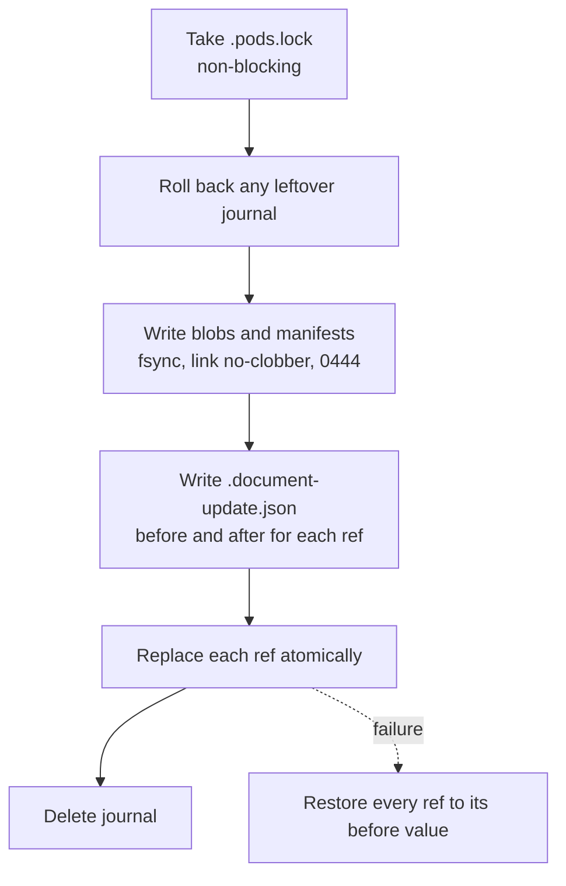

# Storage

**Owns:** the store layout, manifest schemas, document selectors, write and
recovery protocols, pod Git transport, and the session workspace files.
**Related:** [Architecture](ARCHITECTURE.md) explains how these pieces are used.

## 1. Store location

| Setting | Default |
|---|---|
| Store root | `$XDG_DATA_HOME/caiman/store`, else `~/.local/share/caiman/store` |
| Override | `store_root = "/absolute/path"` in `$XDG_CONFIG_HOME/caiman/config.toml` (else `~/.config/...`), or `--store PATH` on any command |

Keep the store outside firmware repositories. Nothing is created until the first
write. The store supports one writer at a time.

## 2. Layout

```text
store/
├── .pods.lock                     writer lock (flock)
├── .document-update.json          ref-publication journal, present only mid-write
├── .removed-pods/POD_ID/UUID/     archived pods (§5)
├── public/
│   ├── pod.json                   {"schema": "caiman.pod.v1", "id": "public", "name": "public"}
│   ├── blobs/sha256/3f/3f9c…      file bytes                         mode 0444
│   ├── manifests/sha256/9f/9f3c…  canonical JSON manifests           mode 0444
│   └── refs/                                                         mode 0600 files
│       ├── documents/ISSUER/PART_OR_PROGRAM/NAME/VERSION
│       ├── document-heads/DOCUMENT_ID
│       ├── collections/COLLECTION_ID
│       ├── boards/NAME/VERSION
│       └── projects/NAME/VERSION
└── alpha/                         same shape; optionally a Git repository
    ├── .git/
    └── .gitattributes
```

- **Blobs and manifests** are immutable and named by the SHA-256 of their bytes.
  The two-character directory is the digest prefix. They are written once with
  a no-clobber hard link and never modified or deleted.
- **Refs** are the only mutable files. Each holds one line: `sha256:<hex>`.
  Path components are percent-encoded; `.` and `..` are encoded too, so an
  opaque version can never become a traversal.
- Directories are `0700`. A symlinked directory, ref, or object is an error.
- Every read checks the digest. A mismatch is an error; no unverified bytes are
  returned.

Pods are discovered from `pod.json`, or from an existing folder with `refs/`.
`public` appears virtually until the first write creates it. A pod's `id` is
stable; its folder and `name` can change. Two local pods with one ID are an
error.

## 3. Manifests

Manifests are canonical JSON: sorted keys, `,` and `:` separators, UTF-8, no
NaN. The digest covers those bytes. Each has a `schema` literal. Literals are a
table, not a formula (S-11): new writes use the first entry; older ones are read
unchanged and never rewritten.

| Kind | Written | Also read |
|---|---|---|
| Document | `caiman.document.v4` | `v3`, `v2`, `v1`, `caiman.document/1` |
| Board | `caiman.board.v3` | `v2`, `caiman.board/1` |
| Project | `caiman.project.v3` | `v2`, `v1`, `caiman.project/1` |
| Collection | `caiman.collection.v2` | `v1` |

Old snapshots are adapted in memory only (`storage/legacy.py`): retired document
fields are hidden and legacy `compartment` routes read as `pod`. Stored bytes
and digests never change.

### 3.1 Document

```json
{
  "schema": "caiman.document.v4",
  "document_id": "6f1c…",
  "previous": null,
  "name": "micro:bit v1.3 integration notes",
  "description": "v1.3 MCU, button and LED wiring, accelerometer, and external piezo route.",
  "issuer": "microbit",
  "part": "bbc-microbit",
  "doc_type": "integration-notes",
  "version": "v1.3-zephyr-4.2.0",
  "silicon_revisions": ["1.3"],
  "source": {"sha256": "d4e1…", "pages": 2184},
  "converter": {"name": "marker"},
  "original_filename": "microbit-v1-hardware.md",
  "pipeline_version": "caiman-ingest/0.1",
  "ingested_at": "2026-10-03T09:14:22.000000Z",
  "files": [{"path": "document.md", "sha256": "3f9c…", "size": 20481}]
}
```

| Field | Rule |
|---|---|
| `issuer`, `version` | Required. `issuer` is an identifier; `version` is any text |
| `name` or `doc_type` | At least one. `name` is the display name; without it, `doc_type` names the ref |
| `part` or `program` | Exactly one, an identifier |
| `description`, `doc_type` | Optional text |
| `silicon_revisions` | Optional list of strings |
| `source` | Optional: `sha256` (64 hex), `pages` (positive integer). Omit unknown fields |
| `converter` | Optional: `name` |
| `document_id`, `previous` | System-generated. `previous` is the prior manifest digest, `null` at first |
| `original_filename`, `ingested_at`, `pipeline_version`, `files` | System-generated. `files` has exactly one entry: `document` plus the input's extension |

Identifiers match `[A-Za-z0-9][A-Za-z0-9_.-]*`. Text fields reject control
characters. Unknown fields are rejected, including the retired `structure` and
`requirements`. The owning pod is not a manifest field.

### 3.2 Collection

```json
{
  "schema": "caiman.collection.v2",
  "id": "b81e…",
  "name": "Sound acceptance",
  "description": "",
  "documents": [{"pod": "public", "document": "6f1c…", "blob": "sha256:3f9c…"}]
}
```

At least one member. Members are sorted and deduplicated before hashing. No
nested collections. `refs/collections/ID` names the current snapshot.

### 3.3 Board

```json
{
  "schema": "caiman.board.v3",
  "board": "bbc-microbit",
  "version": "v2-zephyr-lsm303agr",
  "vendor": "microbit",
  "notes": "Firmware-facing hardware model.",
  "derives_from": "v1.3-zephyr",
  "relation": "Adds the onboard speaker; replaces the accelerometer.",
  "documents": [{"pod": "public", "document": "6f1c…", "blob": "sha256:3f9c…", "notes": "Pinout."}],
  "parts": [
    {"role": "application-mcu", "vendor": "nordic", "part": "nRF52833-QIAA",
     "silicon_revision": "1", "aliases": {"refdes": "U1"},
     "notes": "…", "documents": []}
  ],
  "links": [
    {"name": "speaker-pwm", "between": ["application-mcu.PWM1", "speaker"], "notes": "…"}
  ]
}
```

| Field | Rule |
|---|---|
| `board`, `version`, `parts` | Required; `parts` nonempty |
| `parts[].role` | Required identifier, unique on the board. The part's identity (S-12) |
| `parts[].vendor`, `parts[].part` | Required identifiers |
| `parts[].documents` | Required list of selectors; may be empty |
| `parts[].silicon_revision`, `aliases`, `notes` | Optional. Aliases are string pairs such as `refdes`, `mpn`, `devicetree` |
| `vendor`, `notes`, `documents` | Optional board-level fields; `documents` are assembly documents |
| `links[]` | Unique `name`; endpoints in `between` (two or more) or `from`/`to`. An endpoint is a role or `role.PERIPHERAL` |
| `derives_from`, `relation` | Optional, but both or neither |

`caiman.board/1` boards keep their packed `"part": "vendor/part"` and `refdes`
fields. The guided editor shows them read-only; edit them as raw JSON.

### 3.4 Project

```json
{
  "schema": "caiman.project.v3",
  "project": "microbit-sound",
  "version": "R2-v2",
  "customer": "Caiman",
  "boards": [{"name": "bbc-microbit", "version": "v2-zephyr-lsm303agr",
              "pod": "public", "digest": "sha256:c4a1…"}],
  "documents": [
    {"pod": "public", "document": "6f1c…", "blob": "sha256:3f9c…"},
    {"pod": "public", "collection": "b81e…", "digest": "sha256:aa47…"}
  ]
}
```

| Field | Rule |
|---|---|
| `project`, `version`, `customer`, `boards`, `documents` | Required. `project` is the codename shown to agents; `customer` never leaves the manifest |
| `boards[]` | `name`, `version`, and at save time `pod` and `digest`. One board may appear at several versions, but not the same version twice |
| `documents[]` | Document selectors, or collection references `{pod, collection, digest}` |
| `derives_from`, `relation` | Optional, both or neither |
| `spec_set` | Optional text kept from older snapshots |
| `features[]` | Optional compatibility data (S-14): `name`, `scope` (`required` or `not-used`), `governed_by` (selectors with optional `requirements`), `realized_on` (`{board, version, role}` naming a pinned board), `related` (`{feature, relation}`) |

A feature's governing document must be in the project's document set. Version
1 projects (single `board`, optional `precedence`) still load. The editor
restates them in the current shape: the board becomes `boards[0]`, and documents
listed only in `precedence` move to `documents`. The review shows the change.

### 3.5 Document selectors

| Form | Where | Meaning |
|---|---|---|
| `{"ref": "ISSUER/PART/NAME/VERSION", "pod": "…"}` | Drafts | Named catalog entry, percent-encoded as `caiman documents` prints it |
| `{"digest": "sha256:…", "pod": "…"}` | Drafts; older snapshots | A specific manifest |
| `{"document": "ID", "blob": "sha256:…", "pod": "…"}` | Stored form | Stable identity plus fixed body |

Saving resolves every draft selector to the stored form. A selector without
`pod` searches the owning pod and `public`; more than one match is an error.
Selectors may carry `notes`; feature selectors may carry `requirements`.

## 4. Writes and recovery



- **Lock.** Every write takes an exclusive `flock` on `.pods.lock`. A second
  writer fails immediately.
- **Objects first.** A ref is published only after its objects are durable. A
  failure can leave unreachable objects, never a dangling ref.
- **Journaled refs.** Writes that move several refs at once (document
  registration and metadata edits) record each ref's before and after value.
  Each `before` is checked first; a mismatch means "review again". Opening the
  store rolls back a leftover journal. Readers outside the lock refuse to read
  while one exists.
- **Single refs.** Board, project, and collection saves replace one ref
  atomically (temp file, fsync, rename). They check that the opened ref still
  names the reviewed digest.

| Operation | Refs written |
|---|---|
| Register document | `document-heads/ID` and `documents/…`, journaled |
| Edit document metadata | `document-heads/ID`; the catalog ref (moved if name or version changed), journaled |
| Save collection | `collections/ID` |
| Save board or project | `boards/NAME/VERSION` or `projects/NAME/VERSION`; when a label changes, the old ref is removed only if it still names the edited digest |
| Delete board or project version | Removes the ref; the manifest stays |

Metadata history follows `previous` from the head. Every revision must keep the
same `document_id` and `files`; a cycle or change is an error.

## 5. Pod Git transport

Each pod folder can be its own Git repository on the branch `caiman-store`.

| Command | Effect |
|---|---|
| `pod create NAME` | Create the folder and `pod.json` |
| `pod connect NAME [REMOTE]` | `git init`, set `origin`, write `.gitattributes`. Publishes nothing |
| `pod sync NAME` | Verify, commit, fetch, merge, push (below) |
| `pod clone NAME REMOTE` | Fetch into a temporary folder, verify, then move into place |
| `pod disconnect NAME` | Remove `origin`; keep files and history |
| `pod remove NAME` | Refuse if another pod references it; else move to `.removed-pods/ID/UUID/` |

Sync, under the store lock:

1. Verify every object's digest and every ref's target; reset objects to `0444`.
2. Stage everything and verify the tree before committing: only `pod.json`,
   `.gitattributes`, `blobs/`, `manifests/`, and `refs/{documents,document-heads,collections,boards,projects}/`
   are allowed, all regular files.
3. Commit as "Update Caiman pod".
4. If the remote branch exists: fetch, verify the fetched tree (the same rules,
   a matching pod ID, every ref pointing to a present manifest), and merge. On
   conflict, abort the merge and report the conflicted paths. The local commit
   and fetched history remain.
5. Push without force.

Git runs isolated: no global or system config, no hooks, no redirects,
non-interactive SSH, and only `ssh`, `https`, and `file` protocols. For HTTPS,
only credential-helper settings are imported. Remotes may be SSH, HTTPS without
embedded credentials, or an absolute local path.

`.gitattributes` marks `blobs/**` and `manifests/**` as
`-text -filter -ident -working-tree-encoding -merge`, so Git never rewrites them.

Publication status is kept in the pod's local Git config
(`caiman.publicationHead`, `caiman.publicationRemote`, `caiman.syncFailed`). The
Pods page compares HEAD with the last verified remote commit without network
access.

## 6. Session workspace

Created inside a firmware worktree by the start hook (`sessions/service.py`).

```text
WORKTREE/.caiman/
├── .gitignore                 "*"
├── workspace.json             {"schema": "caiman.workspace.v1", "id": UUID}
└── sessions/HARNESS-SESSION_ID/
    ├── session.json           harness, session_id, created_at, last_start, last_source, transcript_path
    ├── state.json             loaded revision, kind, name, version, pod, digest, document_set, documents, installed_at
    ├── .lock                  per-session flock
    ├── install.json           present only during an install
    └── context/               see Architecture §5
```

- **Session folder name.** `HARNESS` is `claude` or `codex`. The harness session
  ID must match `[A-Za-z0-9][A-Za-z0-9._-]{0,127}`; anything else is refused.
- **`project.json`** (`caiman.session-context.v1`): revision, kind, name,
  version, pod, snapshot digest, `document_set`, boards with digests, and each
  document's path, pod, document ID, manifest digest, and blob.
- **`document_set`** is a SHA-256 over the sorted `(pod, document, blob)`
  triples. It depends only on what was installed, not on the session.
- **Install.** Build the new context in `.staging-*`, write `install.json`, rename
  `context` to `.previous-N`, rename staging to `context`, write `state.json`,
  delete the journal. The next load finishes or rolls back an interrupted
  install, then removes leftovers.
- Installed documents are copies written `0444`.

## 7. Integrity checks

| Check | Where |
|---|---|
| Object bytes match their digest name | Every read; before sync and after fetch |
| Manifest is canonical and valid for its schema | Every manifest read |
| A stored selector carries `pod` and `document`+`blob` (or `digest`); boards carry `digest` | Every configuration read |
| Resolved blob size equals the manifest's `size` | Every document resolution |
| Document head names a manifest with the same `document_id` and pinned blob | Every document resolution |
| Store paths contain no symlinks | Every directory walk and read |
