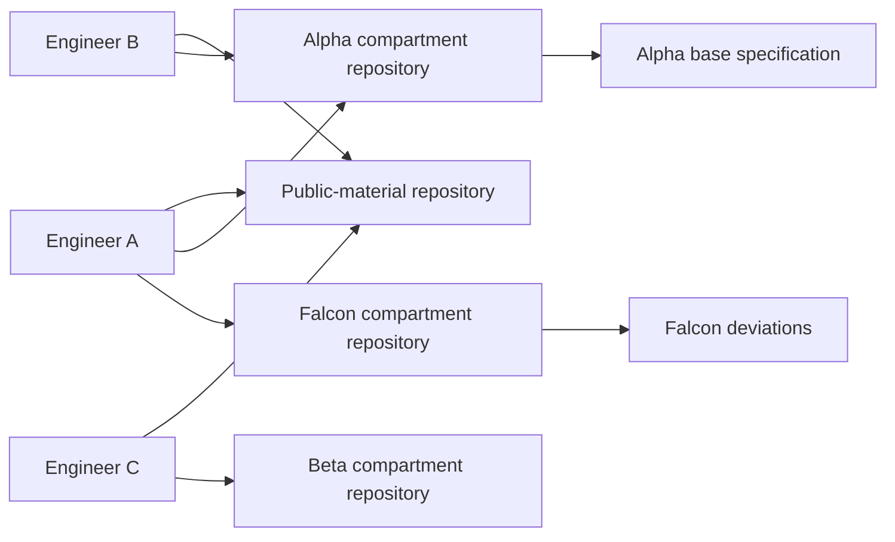
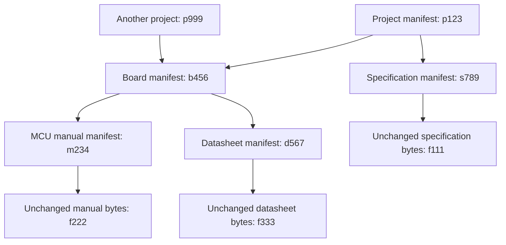
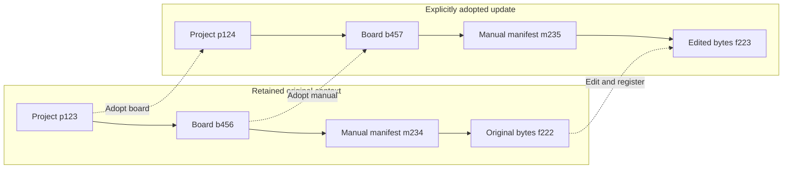
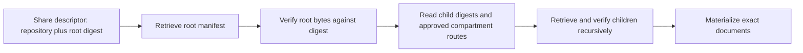
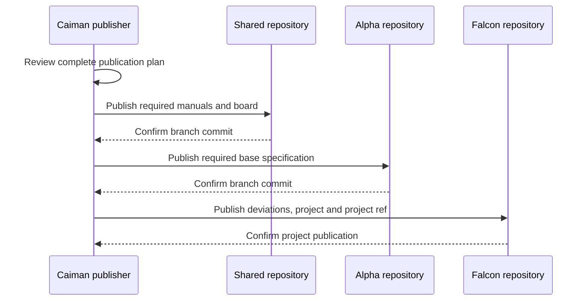

# Team storage: Git remotes and a Merkle DAG

Status: updated 2026-09-24. **Single-compartment documents are decided and enforced
in code.** Repo Manager implements remote registration with format/compartment
checks, unregistering, and local initialization with optional initial metadata
push to an empty remote. Shared document/configuration transport and context
snapshots remain proposed.

Repo Manager stores mappings locally in `<store>/.repositories.json` and creates
independent repositories at `<store>/.repositories/<compartment>/`. Add validates
the managed branch without checking out remote files. Remove preserves local and
hosted repositories. Initialize pushes only a freshly constructed metadata commit,
using a create-only branch lease; existing documents and local commits are never
included. Git-host permissions remain authoritative. Format admission is not full
artifact-graph verification or a check of repository privacy.

This design uses Git remotes with minimal infrastructure and different teammate
access by customer/project. Its access model follows
[S-33](../DECISIONS.md#s-33-each-document-has-one-compartment-compartments-are-repository-boundaries):
each private document has one compartment, and each compartment has one private
repository. There is no separate domain abstraction or AND/OR combination of
labels on a document. Users and project/session scopes can include several
compartments.

[Research and alternatives](../research/storage_architecture_research.md) provide
the supporting sources. [STORAGE.md](../STORAGE.md) and
[SECURITY-MODEL.md](../SECURITY-MODEL.md) describe current contracts; §14 separates
the implemented document rule from proposed transport and configuration changes.

## 1. Recommendation

Keep immutable SHA-256 blobs and manifests. Share them through **one private Git
repository per compartment**, with a dedicated Caiman publication branch in
each repository. Its readers can obtain every byte and every historical version
in that compartment repository.

Caiman provides local authoring, review, dependency-aware publication, verified
fetching and session materialization. The Git host provides authentication and
repository read/write permissions. No database, custom authentication service,
background synchronization daemon, retrieval server or public content network
is required.

One root digest identifies the document/configuration graph. A share descriptor
also supplies a trusted repository location. Publishing a project means its
required dependencies have been published first; a teammate must have access to
all of them to reconstruct its full context.

The unavoidable tradeoff is repository administration and persistent history.
This backend does not offer per-object server-side authorization or deletion of
copies already fetched. If those become requirements, §13 describes the migration
trigger rather than pretending directory labels can enforce them.

## 2. Requirements and boundaries

| ID | Requirement |
|---|---|
| TS-01 | Teammates reconstruct identical pinned configurations and document bytes |
| TS-02 | Customer/project access is enforced by remote repository permissions |
| TS-03 | Every object, including configuration metadata, has an explicit classification |
| TS-04 | A document is public or has exactly one compartment; users may hold several |
| TS-05 | Publication includes only reviewed objects and named reference changes |
| TS-06 | Concurrent publishers cannot silently overwrite the same application reference |
| TS-07 | A published root has a complete retained dependency graph at publication time |
| TS-08 | Sessions hold digests; friendly labels never re-resolve during a session |
| TS-09 | Local authoring and already-materialized work remain usable without the remote |
| TS-10 | Git transport cannot rewrite source Markdown bytes or legacy manifests |
| TS-11 | A document-set hash is distinct from a full context hash and a session receipt |
| TS-12 | Existing stores migrate without destroying their old objects or pins |

The initial target is a small team with trusted publishers and differing read
access. Capacity tests use synthetic data; there is no measured scale claim yet.
Customer documents stay outside firmware repositories and outside Caiman's own
source repository. No customer transcript or observed-read log is published.

Backend access and agent mode are separate decisions: being permitted to fetch
an object does not mean it may be given to an open agent session. The human still
chooses `open` or `sealed`. No model attestation is introduced.

## 3. Deployment and compartment boundaries

Each private document belongs to exactly one compartment. Each compartment has
one private Git repository, and the Git host grants teammates access to that
repository. Public documents use a separate private shared-material repository.
There is no separate domain concept, intersection group or document replication
across compartments. S-33 records this simplification.



A user may belong to several compartments. A project/session may reference a
manual from public, a base specification from Alpha and deviations from Falcon.
Each document still has just one storage location. Access to Alpha does not
implicitly grant Falcon access, even if the project references both.

### 3.1 Classification and repository identity

The current document format retains `labels.public` and `labels.compartments`:

```json
{"public": false, "compartments": ["alpha"]}
```

Public documents use `{"public": true, "compartments": []}`. Empty private
classification, mixed public/private labels, multiple names and duplicate entries
are invalid. Ingestion, registration and readers reject them. An old document
with several labels requires explicit re-ingestion with one chosen compartment;
no automatic choice, rewriting or replication is performed.

| Document | Classification | Publication destination |
|---|---|---|
| Public MCU manual | `public: true`, `compartments: []` | Private public-material repository |
| Alpha base specification | `public: false`, `compartments: ["alpha"]` | Alpha repository only |
| Falcon deviations | `public: false`, `compartments: ["falcon"]` | Falcon repository only |
| Document labeled Alpha and Falcon | Invalid | Reject; publish nothing |
| Document with duplicate Alpha entries | Invalid | Reject; do not silently deduplicate |

For a private document, the access test is membership of its single compartment
in the caller's authorized scope. A teammate with Alpha and Falcon access can
retrieve the two separately classified documents above; neither document needs
multiple labels. The public-material repository is still private on the host:
"public" describes session eligibility, not anonymous download permission.

The planned repository header carries a stable workspace-scoped compartment ID:

```json
{"schema": "caiman.store.v1", "compartment": "alpha"}
```

Approved local configuration maps the compartment to its remote. Renaming or
moving a remote does not change document hashes. Compartment IDs must not be
silently reused for a different audience. The host's membership configuration,
not the repository header or Caiman's catalog, enforces actual read permission.
[Repository roles](https://docs.github.com/en/organizations/managing-user-access-to-your-organizations-repositories/managing-repository-roles/repository-roles-for-an-organization).

### 3.2 Configurations and metadata

The one-compartment constraint implemented by S-33 applies to documents. Existing
project `compartments` still describes its available dependency scopes and keeps
its current local validation. Do not mistake that list for permission to publish
copies of the configuration into every dependency repository.

Before shared configuration publication ships, add an explicitly selected owning
compartment for each private board/project/context snapshot, separate from its
referenced source compartments. Metadata itself must be approved for that owner
compartment's audience. This is a proposed schema change, not implemented by the
document validation update. Publication of legacy multi-compartment configs is
blocked until that ownership is reviewed. Public boards remain supported; a new
classified board schema can represent confidential topology and assembly notes.

Reading a project does not grant access to its dependencies. Publish only when
all required objects are present at their designated repositories; report any
missing access when a teammate reconstructs it. Never copy a dependency into a
broader repository merely to make reconstruction succeed. Metadata ownership
need not equal the full list of source compartments.

A brief is a classified generated artifact. A metadata-only renderer receives
only fields explicitly approved for the selected agent mode. If an open projection
has not been approved, open materialization stops rather than exposing the
private project manifest. This remains a proposed change to the current brief
policy; S-33 does not itself implement it.

### 3.3 Trust and publication authority

A repository reader can obtain all its contents and history without Caiman.
Branches, sparse checkouts and hidden catalog entries are not read boundaries.
Publishers are trusted to classify content correctly; administrators manage
membership, hosting and exceptional withdrawals. Inherited roles and deploy keys
must be considered when provisioning repository access.

Protect the publication branch against force pushes/deletion where supported.
Host/plan support must be checked during onboarding. Client verification catches
mistakes and corrupt objects, but cannot stop a raw Git writer from leaking
material. A receive hook can enforce application rules where available; CI after
upload cannot prevent the upload's disclosure. No hosted CI is required.
[Branch protection](https://docs.github.com/en/repositories/configuring-branches-and-merges-in-your-repository/managing-protected-branches/about-protected-branches).

## 4. Merkle trees, Caiman's DAG, and session identity

### 4.1 What a root hash means

A Merkle tree hashes data at its leaves and hashes parent records containing
child hashes. A root commits to the entire reachable structure. Caiman already
uses the same principle: a document manifest includes the hash of its bytes, a
board includes document-manifest hashes, and a project includes board and
document-manifest hashes.

Because several projects can share a board or document, this is a **Merkle DAG**
(directed acyclic graph), not necessarily a binary tree. No extra tree library
is needed. The graph is about immutable content identity, not Git branches or
an automatic merge algorithm. [Merkle DAG background](https://docs.ipfs.tech/concepts/merkle-dag/).



Arrows mean the parent contains a child digest. Hashes in diagrams are shortened
placeholders; real digests have an algorithm prefix and 64 lowercase hex digits.

Changing manual bytes produces a new blob and document manifest. Adopting that
manifest creates a new board digest; adopting the new board creates a new project
digest. Existing snapshots do not mutate and remain pinned to the old manual.



### 4.2 The hash is an opaque fingerprint

One root hash can identify all documents selected for a session. It cannot reveal
their identities or reconstruct their bytes by itself. Retrieval requires:



The digest is independent of a server's physical address. A compartment-to-remote
mapping supplies location; a repository move does not require rehashing existing
content. A bare digest without configured storage is intentionally insufficient.
Hash equality is useful for comparing committed representations, subject to the
hash's collision resistance. A hash does not establish authorship, factual
correctness, access permission, actual agent reads, or continued availability.

### 4.3 Four identifiers with different purposes

| Identifier | Commits to | Deliberately excludes |
|---|---|---|
| Project digest | Declared configuration and pinned dependencies | Actual session mode, generated files, session identity |
| Document-set digest | Sorted unique document-manifest digests selected for materialization | Session ID, timestamps, local paths, feature/precedence configuration |
| Context digest | Project digest, document-set digest, mode, resolver/materializer versions, generated-file descriptors and dependency routes | Machine path, user identity, timestamp, observed reads |
| Local session receipt | Context digest plus session ID, time, actor and completion state | Document contents; no claim to complete read observation |

The document-set manifest is a small flat root, sufficient at this scale:

```json
{
  "schema": "caiman.document-set.v1",
  "documents": [
    {"digest": "sha256:<manual-manifest-digest>"},
    {"digest": "sha256:<specification-manifest-digest>"}
  ]
}
```

This is illustrative JSON; bracketed digest values must be replaced before use.
Sort by the full digest and remove duplicates. The referenced document manifests
identify the content blobs and their lengths. Adding/removing a document or
changing its manifest changes the document-set digest. Metadata/classification
changes count even if Markdown bytes remain identical. This is document identity,
not a pure checksum of concatenated text.

A document-set manifest is a structural index, not an ingested document. Its
hash covers just the sorted unique document identities. Store it alongside its
owning context in that context's reviewed compartment. Its metadata must be
approved for those readers; its entries do not grant access to the documents.
A set spanning several source compartments does not create a new compartment.

The context manifest additionally contains `project_digest`,
`document_set_digest`, `mode`, `resolver_version`, `materializer_version`, and:

- `files`: ordered-by-path entries with safe relative path, digest and size for
  generated files and materialized document bytes; no absolute machine paths.
- `routes`: ordered entries mapping required manifest digests to stable compartment
  IDs. Compartment IDs are logical identity; remote URLs live in local configuration.
- The owning compartment and explicit exposure policy required by the new context schema.

The context manifest includes all recipe dependencies needed to reproduce the
selection, including the private project, even when the materialized document
set is open. Thus the context manifest can remain restricted. Open mode controls
the agent workspace, not the engineer's access to configuration inputs. The
open workspace gets only the approved projection and selected open documents.

Generated files must not embed the final context digest if their own digests are
included in that context: that would create a cycle. Put the context digest in
an external receipt/sidecar whose bytes are excluded from the hashed file list.
Project precedence arrays keep their order even though the document set is a set.

Publishing a context snapshot is an explicit action. It stores reproducible
configuration metadata in an appropriately restricted store repository, never
the session's local receipt or read logs. Two sessions with identical context
can share a context digest and still have different local receipts.

### 4.4 Canonicalization and graph rules

Continue hashing raw Markdown bytes as SHA-256. Preserve existing manifest bytes
and legacy schema literals. New manifest schemas use an explicit RFC 8785 JSON
encoding contract; use safe integers for sizes and strings for values outside
the interoperable integer range. Duplicate keys, invalid Unicode and non-finite
numbers are rejected. No Unicode or line-ending normalization of source content.
Existing Python serialization is not assumed to be RFC 8785 compatible.
[JSON canonicalization](https://www.rfc-editor.org/rfc/rfc8785.html).

Only fields defined as sets, such as document-set entries, are sorted/deduplicated
before serialization. Document compartment arrays are validated for zero public
or exactly one private entry before any normalization; duplicate labels are an
error. Unknown schema versions fail with an upgrade message. New native/Python
writers must pass the same golden byte/digest vectors.

Strong edges are board/document pins, project dependencies, document blobs,
document-set entries and context reproduction inputs. Declared lineage is a
weak historical edge: it is not an instruction to materialize the ancestor's
documents. Specify these edge types in each schema so traversal never guesses.
Reject cycles, invalid object types, path traversal, duplicate output paths and
resource-limit violations. Bound node count, depth, bytes and manifest size.

New board/project cross-compartment pins carry `compartment`, `digest`, `kind` and
`size`; document blobs inherit their document's compartment. The document-set schema
deliberately stores only manifest digests, with its enclosing context providing
the complete digest-to-compartment route table. Reject ambiguous routes for a required
node. Project-only sharing uses the compartment-qualified pins directly. Physical
remote URLs never belong in immutable pins. The first release supports dependencies
within one configured workspace; cross-workspace imports require explicit review
and ID mapping rather than assuming matching compartment names mean matching access.

## 5. Git repository format and local state

Each private repository has one managed branch, `caiman-store`. Its tree is:

```text
store.json                         format version and stable compartment ID
.gitattributes                     approved transport attributes only
blobs/sha256/<prefix>/<digest>      unchanged document/generated bytes
manifests/sha256/<prefix>/<digest>  canonical JSON objects
refs/documents/<identity>/<label>  application reference record
refs/boards/<identity>/<label>
refs/projects/<identity>/<label>
refs/contexts/<name>/<label>
withdrawals/<manifest-digest>.json optional advisory withdrawal record
```

Application `refs/` are ordinary files, not Git's own refs. Each contains a
canonical record with `digest` and monotonically increasing `generation`.
Names/labels remain opaque, safely encoded path components. Identity/type
validation prevents a ref from pointing to an unrelated object.

Published immutable files stay in the branch's current tree after refs move;
normal publications never delete or modify them. This makes old digest lookup
independent of finding a historical Git commit and keeps default retention simple.
Git commit IDs describe transport history; Caiman digests describe artifacts.
Changing a commit message does not change an artifact digest.

Use `-text -filter -ident -working-tree-encoding` for object paths and a
non-textual merge policy for immutable objects. Caiman performs application ref
reconciliation itself. The implementation should read verified Git object bytes
without checkout filters, not trust arbitrary repository attributes or hooks.
Reject unexpected tracked paths, executable content, symlinks and submodules.
Do not execute scripts shipped in a fetched store. Git supports per-path
conversion and merge attributes; those must not alter Caiman's hashed bytes.
[Git attributes](https://git-scm.com/docs/gitattributes).

Keep the transport mirror separate from local drafts and from the verified
object cache. Fetch into a private directory established at mode `0700` before
the transfer; do not expose content and repair permissions afterward. Cache by
workspace/compartment/digest, not by a globally shared digest path. A process running
as the same OS user remains inside the trust boundary.

A local advisory lock serializes each mirror's mutations. Persist the last
verified transport head, ref generations and pending publication operation in
local state. Multiple machines coordinate through the remote branch, not a
shared filesystem lock. Start without partial clones, alternate object stores
or a shared Git object pool across compartments.

## 6. Discovering and fetching a shared project

A teammate receives a descriptor such as:

```json
{
  "schema": "caiman.share.v1",
  "root_compartment": "falcon",
  "root_digest": "sha256:<project-or-context-manifest-digest>",
  "remote": "ssh://git@example.invalid/team/store-falcon.git"
}
```

This locator is sensitive metadata, not a bearer credential. Receiving it grants
no access. The user onboards the host/compartment explicitly; remote URLs from
untrusted manifests must not cause automatic credential forwarding or arbitrary
network requests. Initial support is SSH and HTTPS to approved hosts, plus local
filesystem remotes for tests. Reject arbitrary Git transport helpers.

The local compartment registry maps approved IDs to remote URLs. A restricted project
can list dependency compartment IDs, but a shared global catalog must not enumerate
private customers or project names. Discover only explicitly configured
repositories that the user can fetch. The root compartment mapping is verified
against `store.json`; identity mismatch stops the operation.

Fetch procedure:

1. Fetch the configured publication branch into a staging mirror without
   automatically merging drafts or changing the active verified view.
2. Check the tree allowlist, compartment classification, object hashes, schema
   versions and ref transitions. Detect unexpected rollback from the last
   accepted Git head. First-use trust comes from onboarding the correct remote.
3. Read the requested root by digest. Resolve named versions only if the user
   selected a name/version, then retain that digest.
4. Traverse strong dependencies through approved compartment routes. Fetch missing
   repositories; verify each object and classification. Do not search unrelated
   compartments or choose another version if a dependency is absent.
5. Report unavailable compartments/objects to the authorized engineer; keep any
   previous materialization intact. Successful verification advances the local
   verified view atomically.

Being able to read the root repository is not proof of access to every
dependency repository. Onboarding must grant the appropriate dependency access;
fetch always checks the actual result. No generic Git client can attest the
permissions of a different teammate. Host-specific ACL inspection may help an
administrator but is not a portable guarantee.

## 7. Publication and concurrent writers

### 7.1 Review describes exactly what will leave the machine

The proposed command flow is `publish plan` followed by `publish apply` for the
reviewed plan. Names are illustrative and not implemented CLI commands.

A plan records root digests, dependency closure, target compartments/remotes, new
objects, reference changes, expected generations and observed Git heads. Its
digest binds the reviewed changes. It identifies every repository receiving
bytes, including dependencies. Local authoring is not publication.

Build outgoing commits from the last verified remote tree plus the allowlisted
reviewed changes, using a separate index. Never push a developer's arbitrary
local branch or automatically commit everything in their store. Review every
newly introduced tree/path in the outgoing history, not only the final diff:
an intermediate commit containing a secret still uploads that secret.

Check target privacy, approved hosting and compartment identity before sending any
objects. A host adapter can verify privacy where available; a generic SSH host
requires an explicit administrator-approved remote configuration. Neither a
successful fetch nor the label `private` proves a host is approved for the data.
No automatic remote creation or upload is implied by ingestion.

### 7.2 Dependency-first, root-last



Order publications by the object dependency graph, not an assumed acyclic graph
of repositories. Repositories can be revisited: an older object in compartment A may
be required by a new object in B, which is then required by a new root in A.
Only new object dependencies must admit a topological order.

Write required blobs before manifests in the local verified cache. For one
remote, a Git commit can introduce the complete local subgraph and its refs
together. Check external strong dependencies at their confirmed published heads
before exposing the parent root. Keep a resumable local operation journal with
each confirmed remote commit. A retry skips verified completed work.

Git offers no transaction across these repositories. If the last push fails,
earlier reviewed dependencies may already be published; report that exact
partial result. Do not roll them back or imply nothing left the machine. Their
presence is safe under their own reviewed classification, and the project ref
has not appeared prematurely. This ordering follows the general data-before-root
pattern also documented by [restic](https://github.com/restic/restic/blob/master/doc/design.rst).

The completeness guarantee assumes normal append-only publication, retained
repositories and unchanged permissions. An administrator deleting a repository,
withdrawing dependencies or changing membership can break later retrieval. Each
fetch verifies completeness again; the protocol does not promise perpetual
availability or a distributed ACL transaction.

### 7.3 Conflict semantics

For a reference observed as `(digest A, generation 7)`, publish a reviewed update
to `(digest B, generation 8)` only if its current record is still the observed
record. Generations catch A-to-B-to-A changes that digest comparison alone misses.

Construct a new commit whose parent is the observed remote head, and use an
ordinary non-force push to the explicit publication branch. If another writer
advances it, fetch and inspect changes:

- Unrelated object/ref additions: rebuild the same reviewed operation on the
  new verified head after checking the target generations remain unchanged.
- Identical desired result already present: report an idempotent success after
  verifying its objects and ref record; never manufacture another version.
- Same ref changed differently, compartment contract changed, or a dependency was
  withdrawn: stop for a new review with base, local and remote values.

Keep retries bounded. If refreshed unrelated changes reveal new unreviewed
content in the outgoing operation, invalidate the plan rather than expanding it.
No last-writer-wins, force push, automatic JSON merge of
manifests, version-name ordering or inferred "latest". Ordinary Git rejection
provides the remote race detector; Caiman supplies the semantic reconciliation.
[Git push behavior](https://git-scm.com/docs/git-push).

A generic Git host does not validate these application generations. Trusted
publishers and verification are part of the initial contract. If the host supports
a receive hook, enforce allowed paths, immutability, classification and ref
transitions there too; cross-repository checks still need careful credentials
and cannot become atomic merely by moving into a hook.

Existing branches/drafts outside the managed publication branch are not part of
the protocol. A protected branch still shares its repository's read audience with
all other branches, so review must happen locally before uploading a draft branch.

## 8. Session materialization and offline work

Resolve one project digest and an explicit mode. The permitted set is determined
by the project pins, declared mode and explicit classifications—not by whichever
downloads happened to succeed. An inaccessible permitted dependency is an error;
it is not silently filtered out as if it were intentionally excluded by mode.

Generate the document-set and context manifests as defined in §4. Validate paths,
verify bytes, and write a sibling staging directory under restrictive permissions.
Prefer filesystem clones, then copies; do not share writable hardlink inodes
between caches and workspaces. Mark materialized documents read-only as an
accident guard. Read-only mode does not prevent the owner from changing modes.

Install the completed generation with a recoverable directory-swap protocol:
journal the transition, move any previous generation aside, rename the complete
staging generation into place, then mark the receipt complete. Recovery restores
the old complete generation or finishes installing the new one. Never expose a
partially populated document directory. This does not claim POSIX can atomically
replace any nonempty directory with a single portable rename.

Offline authoring remains fully local. An explicit offline materialization may
use a complete verified cached graph and records the last policy/withdrawal
check time in the local receipt. It cannot claim current remote authorization.
Online materialization refreshes required repositories and withdrawal records;
an online failure does not silently become offline success. Existing sessions
continue on their pinned files when networking fails.

## 9. Retention, withdrawal and recovery

### 9.1 Initial retention policy

Retain all published blobs and manifests in the current tree. Ref replacement
does not delete old snapshots. No remote garbage collection of application
objects in the first release. Local temporary uploads and incomplete staging
directories may be cleaned after their operation journals are resolved.

If selective application GC is introduced later, retained project/context roots,
document/board refs, explicitly archived versions and in-progress publications
all participate in reachability. Cross-repository pins make independent local
GC unsafe. Introduce an explicit retention registry or coordinated maintenance
protocol before deleting published dependencies. Git's internal object packing
is separate from application-level garbage collection.

### 9.2 Withdrawal is advisory to Git readers

A withdrawal record names an old digest and a reason/replacement. Online Caiman
refuses newly materializing withdrawn artifacts and reports dependents that need
new pins. This is a client behavior, not server-side per-object revocation:
authorized Git readers can still retrieve the historical object.

For a classification mistake, stop further publication, restrict the affected
repository if necessary, publish corrected identities only into the right compartment,
and explicitly repin affected configs. A history rewrite, if chosen as an incident
operation, does not erase clones, forks, backups or session transcripts.
Never perform a history rewrite automatically.

When adding a new audience to an existing repository, review its entire retained
history. Creating a new clean repository for a narrower approved subset is safer
than granting access to an old repository containing out-of-scope history.
Revoking a member affects future host access, not their already-downloaded files.

### 9.3 Backups and restoration

Maintain an independent, access-equivalent backup per compartment. A remote is not a
complete backup strategy when the same credentials can delete both copies.
Back up compartment mappings and host membership/protection configuration separately;
Git history does not recreate host ACLs. Preserve approved hosting boundaries
for backups too.

Periodic self-contained Git bundles are one simple portable option. Verify them
and periodically restore into empty private directories. Bundle completeness is
per repository, so a project recovery set includes every dependency compartment.
[Git bundle documentation](https://git-scm.com/docs/git-bundle).

For the first pilot, target daily independent backups and a demonstrated restore
within one working day; these are proposed operational targets, not an SLA.
The owner must choose an acceptable recovery point before real team rollout.
Restore root manifests, walk dependencies, hash all required bytes, and only then
mark the recovered store usable. Include retained context snapshots in the drill.

## 10. Capacity and transport evolution

Start with whole Markdown blobs in ordinary Git. Do not split, summarize or
normalize a document for transport. Git can delta-compress similar immutable
objects; actual savings for digest-named files require measurement.
[Git packing](https://git-scm.com/docs/git-pack-objects).

Preflight the selected host's file and push limits before upload. At the research
date GitHub warns above 50 MiB and blocks ordinary Git files above 100 MiB; these
values are host-specific and should live in a checked capability profile, not
the artifact schema. [GitHub large-file documentation](https://docs.github.com/en/repositories/working-with-files/managing-large-files/about-large-files-on-github).

Measure fresh clone time, incremental fetch bytes, packed size, peak memory and
local verification time for 100, 1,000 and 10,000 synthetic document revisions,
including large manuals and small edits. Report corpus size, hardware and Git
version with results. No thresholds are justified by measurements yet.

If whole files exceed host limits, fail publication with an actionable explanation.
Git LFS is a possible next format version, not an automatic fallback. Its design
must explicitly cover uploading payloads before pointer commits, access boundaries,
quota failures, backup, offline hydration and detecting a pointer where document
bytes are expected. Keep the Caiman digest over original bytes, not pointer text.
The initial reader rejects unexpected LFS/filter configuration.

## 11. Failure matrix

| Failure | Required behavior |
|---|---|
| A document has several compartment entries, including duplicates | Reject during ingestion, registration and read; never select a label or publish copies |
| A required dependency compartment is unreadable | Fail reconstruction; do not substitute a different document |
| Upload interrupted before a remote commit | Retry from journal; verify remote state before claiming failure or success |
| Dependency pushes succeed; root push fails | Report partial publication; root remains unpublished |
| Push response lost after acceptance | Fetch and compare planned result; return idempotent success if confirmed |
| Two authors update one ref | Reject/review conflict; preserve both immutable candidate snapshots locally |
| Remote file bytes do not match their Caiman digest | Quarantine fetched view; retain last verified local generation |
| Remote publication head rolls backward | Stop online update and require explicit recovery review |
| Compartment IDs or approved routes change unexpectedly | Stop; do not send credentials or reclassify objects |
| A publisher uses raw Git to violate the format | Verified readers reject; prevention requires host-side enforcement |
| New schema unsupported by client | Fail with upgrade requirement; no best-effort reinterpretation |
| Local materialization runs out of space | Preserve or recover prior complete generation |
| Withdrawal received | Refuse new materialization via Caiman; explain Git history remains retrievable |
| Remote unavailable | Existing files remain usable; explicit offline mode required for a new cached materialization |

## 12. Implementation sequence and acceptance criteria

### Phase 1: Format and local correctness

Specify new classified board/project/context schemas, compartment repository headers,
strong/weak edges, RFC 8785 bytes, reference generations and legacy readers.
Extract a transport-independent graph walker from current pin resolution. Build
local verification and a synthetic two-compartment migration fixture.

Acceptance: legacy bytes/digests unchanged; confidential boards accepted only by
the new schema; multi-compartment document rejected before publication; canonical
vectors match across implementations; missing/cyclic/mistyped dependencies fail.

### Phase 2: Git publication and fetch

Implement separate mirrors, local locks, approved remote configuration, plans,
allowlisted commits, generation comparisons and resumable dependency publication.
Use local bare repositories for automated integration tests, then a private host
pilot with synthetic data. No real documents in tests or CI.

Acceptance: two writers on one ref conflict; unrelated updates reconcile; unreviewed
local objects and intermediate commits never leave the machine; concurrent retry
and lost responses are idempotent; bytes survive line-ending/filter settings;
root publication does not precede dependency confirmation; unauthorized host
identity cannot clone restricted repositories. Test host ACLs with distinct users,
not just Caiman's local filters.

### Phase 3: Context snapshots and materialization

Implement document-set/context manifests, safe generated projections, complete
staging, offline behavior and explicit snapshot sharing. Keep receipts/read logs
outside Git.

Acceptance: same selected docs yield the same document-set hash despite differing
session IDs; changing precedence changes project/context identity but not the
document-set identity; document metadata changes affect its identity; changing
mode changes context identity; a bare hash cannot resolve without a configured
route; a fresh authorized machine reconstructs the shared context byte-for-byte.
An open workspace contains no restricted source manifest, brief field or document.

### Phase 4: Team pilot and operations

Provision public, Alpha, Falcon and Beta repositories with distinct test users.
Run publication interruptions, permission removal, old-version reconstruction,
backup restore and workload measurements. Document repository administration.

Acceptance: Alpha-only users cannot clone Falcon; a project requiring both
reports the missing repository rather than omitting its document; withdrawal is
accurately reported as advisory; old pins survive moving labels; a clean-machine
restore includes external dependencies. Record actual host/plan and protections.

Ship the transport only after Phase 2's host pilot. Claim reproducible shared
session snapshots only after Phase 3. Capacity and recovery claims wait for Phase 4.

## 13. When to outgrow Git

Revisit an authenticated object API when any of these becomes a recurring cost:

- Repository membership administration dominates usage.
- Per-object access changes or server-enforced withdrawal are required.
- Whole-history transfers or host limits obstruct ordinary document revisions.
- Retention must delete individual objects under a demonstrable backend policy.
- A centrally managed catalog or multi-writer transaction model becomes necessary.

The likely successor is immutable object storage plus transactional refs,
membership, retention and publication records in a database. Upload verified
objects first, then commit metadata; coordinate GC with active publications.
Do not assume object-store consistency supplies cross-object/database transactions.
An OCI adapter remains possible, but Caiman's custom manifests need explicit
wrapping and graph retention. See the [alternative research](../research/storage_architecture_research.md).

Keep object bytes, SHA-256 identities and logical compartment routes portable now.
Do not build a general backend framework or operate a service before this trigger.

## 14. Adoption and migration

S-33 settles single-compartment documents and compartment repository boundaries.
Ingestion, registration, read validation and the document form enforce the rule.
The Git transport and other schema changes remain proposed.

| Existing rule/decision | Status / proposed change |
|---|---|
| S-22 / G23: one repository versus per-compartment repositories | Resolved by S-33: one private repository per compartment |
| Earlier access-domain/intersection design | Removed; each document has one compartment |
| Document `labels.compartments` array | Retained, with zero public/one private entry enforced |
| Project dependency scopes | May contain several compartments; current local config behavior preserved |
| Config publication ownership | Add one explicit owning compartment before enabling remote config publication |
| Public boards / always-open brief | Classified boards and approved metadata projections remain proposals |
| S-18 / S-21 | Preserve local CAS and agent filesystem interface; Git transport needs no service |
| Session logs excluded from store | Preserve exclusion; share context artifacts separately from execution logs |
| OCI-subset claim | OCI-inspired layout; interoperability still requires an adapter |

Migration is explicit and reviewed:

1. Inventory and verify existing objects, refs and labels; make a private backup.
2. Flag old multi-compartment documents as invalid. The owner must re-ingest each
   with one reviewed compartment and explicitly repin dependencies. Do not choose
   the first label, infer a combination, or modify old bytes/digests.
3. Provision empty private repositories for actual compartments and approved
   readers. Never initialize the old whole-store directory as one team repository.
4. Import valid document bytes unchanged into their one compartment. Public
   material goes into its own private repository. Preserve valid legacy digests.
5. Review an owning compartment for each configuration before remote publication.
   Emit new schema snapshots and an old-to-new digest report when necessary;
   keep original local snapshots unchanged. New contexts require explicit ownership.
6. Review publication plans; publish dependencies first, then roots. Validate
   reconstruction from a clean client with the intended teammate permissions.
7. Retain the previous local store until verification and backup restoration pass.

The actual Git host, hosting approval, repository administrators and recovery
objectives remain deployment choices. They do not change the single-compartment
rule. Invalid historical document objects stay on disk for manual remediation;
they are not accepted by normal document readers or silently migrated.
